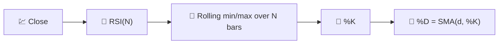

# 🎛️ Stochastic RSI

Stochastic RSI applies the **Stochastic Oscillator's own formula** to the RSI series instead of to raw price. It is, quite literally, "an oscillator of an oscillator" — designed to catch overbought/oversold extremes *within* the RSI itself.

---

## 💡 Financial Meaning

Plain RSI can drift in the 40–60 zone for long stretches without ever reaching the classic 30/70 thresholds, especially in low-volatility markets. Stochastic RSI rescales RSI's own recent range to 0–100 every bar, so it reaches its extremes far more often — giving more frequent, faster signals at the cost of more noise and false positives.

---

## 🔢 Mathematical Formulas

1.  **Base RSI** series (see [RSI](rsi.md)), using the configured lookback $N$:

    $$
    RSI_t = 100 - \frac{100}{1+RS_t}
    $$

2.  **Stochastic transform** applied to RSI itself — where it currently sits relative to its own $N$-period high/low range:

    $$
    \%K_t = 100 \cdot \frac{RSI_t - \min_{0 \le i < N} RSI_{t-i}}{\max_{0 \le i < N} RSI_{t-i} - \min_{0 \le i < N} RSI_{t-i}}
    $$

3.  **%D** — a short moving average of %K that smooths the raw stochastic line:

    $$
    \%D_t = SMA_{d}(\%K)
    $$

---

## ⚙️ Parameters

| Parameter | Key | Default | Description |
|---|---|---|---|
| Stochastic Period ($N$) | `period` | 14 | Shared lookback for the underlying RSI and its stochastic %K range. |
| D Period ($d$) | `dPeriod` | 3 | SMA window applied to %K to produce %D. |
| Overbought | `overbought` | 80 | Threshold for the overbought zone. |
| Oversold | `oversold` | 20 | Threshold for the oversold zone. |

!!! note "Shared RSI and stochastic lookback"

    LibreFolio passes `period` to TA-Lib as both the underlying RSI period and the
    stochastic %K lookback. A separate RSI-length parameter is intentionally not exposed.

---

## 🎛️ Signal Processing Equivalent — Cascaded Normalisation Stages

Stochastic RSI is a **two-stage cascade**: stage one (RSI) rectifies and normalises the price derivative into 0–100; stage two (Stochastic) re-normalises *that* signal against its own recent envelope, then smooths with a short FIR average (%D). Cascading two bounded, self-normalising stages produces a signal that saturates at its rails much more aggressively than either stage alone.

!!! tip "Faster but noisier"

    Because it normalises against a *local* window instead of a fixed 0–100 scale,
    %K can swing from 0 to 100 in just a few bars — useful for quick reversal signals,
    but more prone to whipsaws than plain RSI.

:material-link: [Stochastic RSI on StockCharts](https://school.stockcharts.com/doku.php?id=technical_indicators:stochrsi){ target="_blank" }
