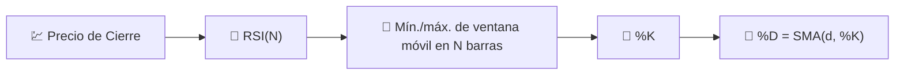

# 🎛️ RSI Estocástico

El RSI Estocástico aplica la **propia fórmula del Oscilador Estocástico** a la serie RSI en lugar de al precio bruto. Es, literalmente, "un oscilador de un oscilador", diseñado para detectar extremos de sobrecompra/sobreventa *dentro* del propio RSI.

---

## 💡 Significado Financiero

El RSI simple puede permanecer en la zona de 40–60 durante largos períodos sin alcanzar nunca los umbrales clásicos de 30/70, especialmente en mercados de baja volatilidad. El RSI Estocástico reescala el rango reciente del propio RSI a 0–100 en cada barra, por lo que alcanza sus extremos con mucha más frecuencia, dando señales más frecuentes y rápidas a costa de más ruido y falsos positivos.

---

## 🔢 Fórmulas Matemáticas

1. **Serie RSI base** (ver [RSI](rsi.md)), utilizando la retrospectiva configurada $N$:

    $$
    RSI_t = 100 - \frac{100}{1+RS_t}
    $$

2. **Transformación estocástica** aplicada al propio RSI: dónde se sitúa actualmente en relación con su propio rango máximo/mínimo de $N$ períodos:

    $$
    \%K_t = 100 \cdot \frac{RSI_t - \min_{0 \le i < N} RSI_{t-i}}{\max_{0 \le i < N} RSI_{t-i} - \min_{0 \le i < N} RSI_{t-i}}
    $$

3. **%D** — un promedio móvil corto de %K que suaviza la línea estocástica bruta:

    $$
    \%D_t = SMA_{d}(\%K)
    $$

---

## ⚙️ Parámetros

| Parámetro | Clave | Por defecto | Descripción |
|---|---|---|---|
| Retrospectiva ($N$) | `period` | 14 | Retrospectiva compartida para el RSI subyacente y su rango estocástico %K. |
| Ventana D ($d$) | `dPeriod` | 3 | Ventana SMA aplicada a %K para producir %D. |
| Sobrecompra | `overbought` | 80 | Umbral para la zona de sobrecompra. |
| Sobreventa | `oversold` | 20 | Umbral para la zona de sobreventa. |

!!! note "Retrospectiva compartida entre RSI y estocástico"

    LibreFolio pasa `period` a TA-Lib tanto como el período del RSI subyacente como la
    retrospectiva del %K estocástico. A propósito, no se expone un parámetro independiente para el período del RSI.

---

## 🎛️ Equivalente de Procesamiento de Señales — Etapas de Normalización en Cascada

El RSI Estocástico es una **cascada de dos etapas**: la etapa uno (RSI) rectifica y normaliza la derivada del precio en un rango de 0–100; la etapa dos (Estocástico) renormaliza *esa* señal contra su propio envolvente reciente, luego la suaviza con un promedio FIR corto (%D). La combinación en cascada de dos etapas acotadas y auto-normalizadoras produce una señal que satura en sus límites de manera mucho más agresiva que cualquiera de las etapas por separado.

!!! tip "Más rápido pero más ruidoso"

    Debido a que normaliza contra una ventana *local* en lugar de una escala fija de 0–100,
    %K puede oscilar de 0 a 100 en solo unas pocas barras; es útil para señales rápidas de reversión,
    pero más propenso a falsas rupturas que el RSI simple.

:material-link: [RSI Estocástico en StockCharts](https://school.stockcharts.com/doku.php?id=technical_indicators:stochrsi){ target="_blank" }
