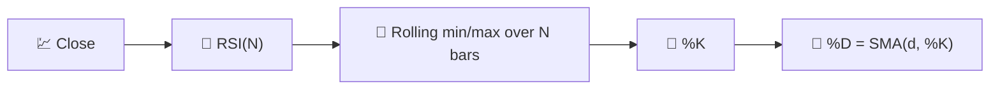

# 🎛️ RSI Stochastique

Le RSI Stochastique applique **la propre formule de l'oscillateur stochastique** à la série RSI plutôt qu'au prix brut. C'est, littéralement, « un oscillateur d'un oscillateur » — conçu pour capturer les extrêmes de surachat/survente *au sein* du RSI lui-même.

---

## 💡 Signification Financière

Le RSI simple peut stagner dans la zone 40–60 pendant de longues périodes sans jamais atteindre les seuils classiques de 30/70, en particulier sur les marchés à faible volatilité. Le RSI Stochastique remet à l'échelle la plage récente du RSI lui-même sur 0–100 à chaque barre, atteignant ainsi ses extrêmes bien plus souvent — fournissant des signaux plus fréquents et plus rapides, au prix de davantage de bruit et de faux positifs.

---

## 🔢 Formules Mathématiques

1. **Série RSI de base** (voir [RSI](rsi.md)), en utilisant la période de référence configurée $N$ :

    $$
    RSI_t = 100 - \frac{100}{1+RS_t}
    $$

2. **Transformation stochastique** appliquée au RSI lui-même — où il se situe actuellement par rapport à sa propre fourchette haute/basse sur $N$ périodes :

    $$
    \%K_t = 100 \cdot \frac{RSI_t - \min_{0 \le i < N} RSI_{t-i}}{\max_{0 \le i < N} RSI_{t-i} - \min_{0 \le i < N} RSI_{t-i}}
    $$

3. **%D** — une moyenne mobile à court terme de %K qui lisse la ligne stochastique brute :

    $$
    \%D_t = SMA_{d}(\%K)
    $$

---

## ⚙️ Paramètres

| Paramètre | Clé | Défaut | Description |
|---|---|---|---|
| Période stochastique ($N$) | `period` | 14 | Période de référence partagée pour le RSI sous-jacent et sa plage stochastique %K. |
| Période D ($d$) | `dPeriod` | 3 | Fenêtre SMA appliquée à %K pour produire %D. |
| Surachat | `overbought` | 80 | Seuil pour la zone de surachat. |
| Survente | `oversold` | 20 | Seuil pour la zone de survente. |

!!! note "Fenêtre de recul partagée RSI et stochastique"

    LibreFolio transmet `period` à TA-Lib à la fois comme période du RSI sous-jacent et comme
    fenêtre de recul stochastique %K. Un paramètre distinct pour la longueur du RSI n'est volontairement pas exposé.

---

## 🎛️ Équivalent Traitement du Signal — Étapes de Normalisation en Cascade

Le RSI Stochastique est une **cascade à deux étages** : le premier étage (RSI) redresse et normalise la dérivée du prix sur 0–100 ; le second étage (Stochastique) *re-normalise* ce signal par rapport à sa propre enveloppe récente, puis le lisse avec une courte moyenne FIR (%D). La mise en cascade de deux étages bornés et auto-normalisants produit un signal qui sature à ses limites bien plus agressivement que chaque étage pris individuellement.

!!! tip "Plus rapide mais plus bruyant"

    Parce qu'il normalise par rapport à une fenêtre *locale* au lieu d'une échelle fixe 0–100,
    %K peut passer de 0 à 100 en seulement quelques barres — utile pour des signaux de retournement rapides,
    mais plus sujet aux faux signaux que le RSI simple.

:material-link: [Stochastic RSI on StockCharts](https://school.stockcharts.com/doku.php?id=technical_indicators:stochrsi){ target="_blank" }
