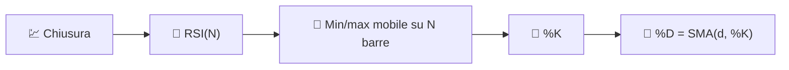

# 🎛️ RSI Stocastico

L'RSI Stocastico applica la **Formula dell'Oscillatore Stocastico** alla serie dell'RSI anziché al prezzo grezzo. È, letteralmente, "un oscillatore di un oscillatore" — progettato per catturare gli estremi di ipercomprato/ipervenduto *all'interno* dell'RSI stesso.

---

## 💡 Significato Finanziario

L'RSI classico può rimanere nella zona 40–60 per lunghi periodi senza mai raggiungere le soglie classiche di 30/70, specialmente in mercati a bassa volatilità. L'RSI Stocastico riscala il range recente dell'RSI stesso su 0–100 per ogni barra, quindi raggiunge i suoi estremi molto più spesso — fornendo segnali più frequenti e veloci, al costo di maggiore rumore e falsi positivi.

---

## 🔢 Formule Matematiche

1. **Serie RSI base** (vedi [RSI](rsi.md)), utilizzando il lookback configurato $N$:

    $$
    RSI_t = 100 - \frac{100}{1+RS_t}
    $$

2. **Trasformazione stocastica** applicata all'RSI stesso — dove si trova attualmente rispetto al suo range massimo/minimo su $N$ periodi:

    $$
    \%K_t = 100 \cdot \frac{RSI_t - \min_{0 \le i < N} RSI_{t-i}}{\max_{0 \le i < N} RSI_{t-i} - \min_{0 \le i < N} RSI_{t-i}}
    $$

3. **%D** — una media mobile corta del %K che attenua la linea stocastica grezza:

    $$
    \%D_t = SMA_{d}(\%K)
    $$

---

## ⚙️ Parametri

| Parametro | Chiave | Default | Descrizione |
|---|---|---|---|
| Periodo Stocastico ($N$) | `period` | 14 | Lookback condiviso per l'RSI sottostante e il suo range %K stocastico. |
| Periodo D ($d$) | `dPeriod` | 3 | Finestra SMA applicata a %K per produrre %D. |
| Ipercomprato | `overbought` | 80 | Soglia per la zona di ipercomprato. |
| Ipervenduto | `oversold` | 20 | Soglia per la zona di ipervenduto. |

!!! note "Lookback condiviso per RSI e stocastico"

    LibreFolio passa `period` a TA-Lib sia come periodo dell'RSI sottostante sia come
    lookback stocastico %K. Un parametro separato per la lunghezza dell'RSI non è intenzionalmente esposto.

---

## 🎛️ Equivalente di Elaborazione del Segnale — Stadi di Normalizzazione a Cascata

L'RSI Stocastico è una **cascata a due stadi**: il primo stadio (RSI) raddrizza e normalizza la derivata del prezzo in 0–100; il secondo stadio (Stocastico) ri-normalizza *quel* segnale rispetto al suo recente inviluppo, quindi lo attenua con una media FIR corta (%D). La cascata di due stadi limitati e auto-normalizzanti produce un segnale che satura ai suoi limiti molto più aggressivamente di quanto faccia ciascuno stadio da solo.

!!! tip "Più veloce ma più rumoroso"

    Poiché normalizza rispetto a una finestra *locale* invece che a una scala fissa 0–100,
    %K può oscillare da 0 a 100 in poche barre — utile per segnali rapidi di inversione,
    ma più soggetto a falsi segnali rispetto all'RSI classico.

:material-link: [RSI Stocastico su StockCharts](https://school.stockcharts.com/doku.php?id=technical_indicators:stochrsi){ target="_blank" }
