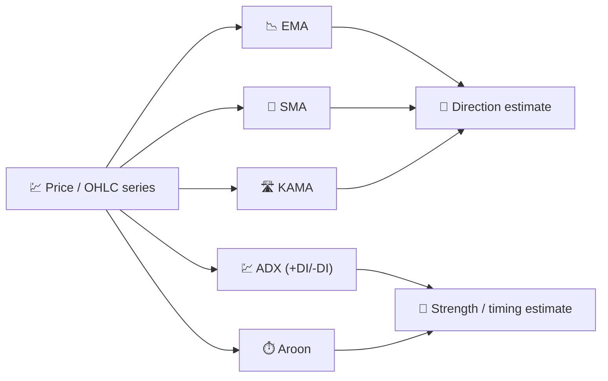

# 🧭 Trend Indicators

Trend indicators answer the most basic question in technical analysis: *"which way is the price actually going, once the day-to-day noise is filtered out?"* They all act as **low-pass filters** on the price series, smoothing short-term fluctuations to reveal the underlying direction.

---

## 💡 What This Group Measures

A trend indicator estimates the **local mean** of the price process (or, for ADX/Aroon, the *strength* and *timing* of directional moves). None of them predict the future; they describe the recent past in a way that is less noisy than the raw close price, which makes crossovers and slope changes easier to act on.

---

## 📋 Indicators in This Category

| Indicator | What It Measures | Key Use | Details |
|-----------|-------------------|---------|---------|
| **EMA** | Exponentially-weighted trend | Golden/death cross detection | [📖](ema.md) |
| **SMA** | Equally-weighted trend | Stable baseline and crossover reference | [📖](sma.md) |
| **KAMA** | Adaptive, efficiency-aware trend | Trend-following in choppy vs trending regimes | [📖](kama.md) |
| **ADX** | Trend *strength* (not direction) | Filtering out range-bound markets | [📖](adx.md) |
| **Aroon** | Time since last extreme high/low | Detecting the *birth* of a new trend | [📖](aroon.md) |

---

## 📥 Data Requirements

| Indicator | Inputs | Notes |
|-----------|--------|-------|
| EMA / SMA / KAMA | `close` | Pure price-smoothing filters |
| ADX | `high`, `low`, `close` | Needs directional movement (`+DM`/`-DM`) and true range |
| Aroon | `high`, `low` | Uses only the *timing* of extremes, not their magnitude |

---

## 🔍 Comparison Table

| Indicator | Default Period | Output Range | Filter Type |
|-----------|-----------------|---------------|-------------|
| EMA | 14 | Price scale | IIR (1 pole) |
| SMA | 20 | Price scale | FIR (rectangular window) |
| KAMA | 10 | Price scale | Adaptive IIR (variable $\alpha$) |
| ADX | 14 | 0–100 | Smoothed ratio of directional movement |
| Aroon | 14 | 0–100 (Up/Down), −100–100 (Oscillator) | Time-since-extreme counter |

!!! info "Direction vs strength"

    EMA, SMA and KAMA tell you **where** the trend is; ADX and Aroon tell you **how
    convinced** you should be that a trend exists at all. Combining a moving average
    with ADX is a classic way to avoid whipsaws in sideways markets.

---

## 🔗 Related

- 📉 **[All Indicators](index.md)** — Full catalogue with financial and signal-processing views
- 💪 **[Momentum Indicators](momentum.md)** — Rate-of-change and oscillator family
- 📏 **[Volatility Indicators](volatility.md)** — Dispersion around the trend
