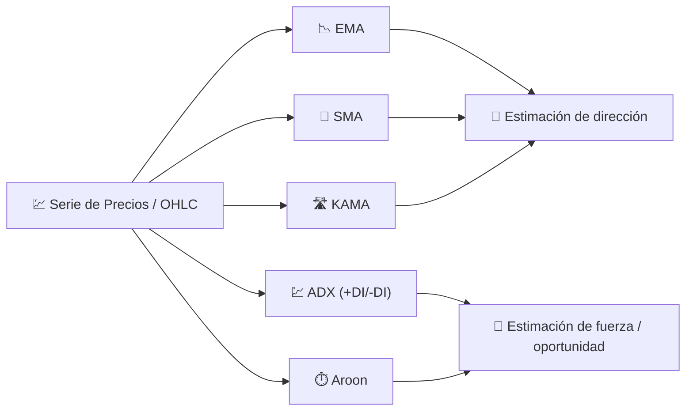

# 🧭 Indicadores de Tendencia

Los indicadores de tendencia responden a la pregunta más básica del análisis técnico: *"¿hacia dónde se dirige realmente el precio, una vez que se filtra el ruido diario?"* Todos actúan como **filtros de paso bajo** sobre la serie de precios, suavizando las fluctuaciones a corto plazo para revelar la dirección subyacente.

---

## 💡 Qué Mide Esta Categoría

Un indicador de tendencia estima la **media local** del proceso de precios (o, para ADX/Aroon, la *fuerza* y la *oportunidad* de los movimientos direccionales). Ninguno predice el futuro; describen el pasado reciente de una manera menos ruidosa que el precio de cierre sin procesar, lo que facilita la acción sobre cruces y cambios de pendiente.

---

## 📋 Indicadores en Esta Categoría

| Indicador | Qué Mide | Uso Clave | Detalles |
|-----------|----------|-----------|----------|
| **EMA** | Tendencia con ponderación exponencial | Detección de cruce dorado/de la muerte | [📖](ema.md) |
| **SMA** | Tendencia con ponderación igual | Línea base estable y referencia de cruce | [📖](sma.md) |
| **KAMA** | Tendencia adaptativa consciente de la eficiencia | Seguimiento de tendencia en regímenes laterales vs. tendenciales | [📖](kama.md) |
| **ADX** | *Fuerza* de la tendencia (no dirección) | Filtrar mercados en rango | [📖](adx.md) |
| **Aroon** | Tiempo desde el último máximo/mínimo extremo | Detectar el *nacimiento* de una nueva tendencia | [📖](aroon.md) |

---

## 📥 Requisitos de Datos

| Indicador | Entradas | Notas |
|-----------|----------|-------|
| EMA / SMA / KAMA | `close` | Filtros puros de suavizado de precios |
| ADX | `high`, `low`, `close` | Necesita movimiento direccional (`+DM`/`-DM`) y rango verdadero |
| Aroon | `high`, `low` | Utiliza solo el *tiempo transcurrido* desde los extremos, no su magnitud |

---

## 🔍 Tabla Comparativa

| Indicador | Período por Defecto | Rango de Salida | Tipo de Filtro |
|-----------|---------------------|-----------------|----------------|
| EMA | 14 | Escala de precio | IIR (1 polo) |
| SMA | 20 | Escala de precio | FIR (ventana rectangular) |
| KAMA | 10 | Escala de precio | IIR adaptativo ($\alpha$ variable) |
| ADX | 14 | 0–100 | Cociente suavizado del movimiento direccional |
| Aroon | 14 | 0–100 (Arriba/Abajo), −100–100 (Oscilador) | Contador de tiempo desde el extremo |

!!! info "Dirección vs fuerza"

    EMA, SMA y KAMA te indican **dónde** está la tendencia; ADX y Aroon te indican **qué tan fuerte** es. Combinar una media móvil con ADX es una forma clásica de evitar señales falsas en mercados laterales.

---

## 🔗 Relacionados

- 📉 **[Todos los Indicadores](index.md)** — Catálogo completo con perspectivas financieras y de procesamiento de señales
- 💪 **[Indicadores de Momentum](momentum.md)** — Familia de osciladores y tasa de cambio
- 📏 **[Indicadores de Volatilidad](volatility.md)** — Dispersión alrededor de la tendencia
