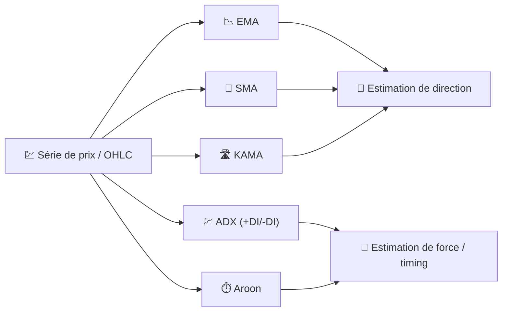

# 🧭 Indicateurs de tendance

Les indicateurs de tendance répondent à la question la plus fondamentale de l'analyse technique : *« dans quelle direction évolue réellement le prix, une fois que le bruit quotidien est filtré ? »* Tous agissent comme des **filtres passe-bas** sur la série des prix, lissant les fluctuations à court terme pour révéler la direction sous-jacente.

---

## 💡 Ce que ce groupe mesure

Un indicateur de tendance estime la **moyenne locale** du processus de prix (ou, pour ADX/Aroon, la *force* et le *timing* des mouvements directionnels). Aucun d'entre eux ne prédit l'avenir ; ils décrivent le passé récent d'une manière moins bruitée que le cours de clôture brut, ce qui facilite l'exploitation des croisements et des changements de pente.

---

## 📋 Indicateurs de cette catégorie

| Indicateur | Ce qu'il mesure | Utilisation clé | Détails |
|-----------|-------------------|---------|---------|
| **EMA** | Tendance pondérée exponentiellement | Détection de croisement doré / mortel | [📖](ema.md) |
| **SMA** | Tendance à pondération égale | Référence stable pour les croisements | [📖](sma.md) |
| **KAMA** | Tendance adaptative et basée sur l'efficacité | Suivi de tendance en régimes hésitants vs. marqués | [📖](kama.md) |
| **ADX** | *Force* de la tendance (pas la direction) | Filtrage des marchés sans tendance | [📖](adx.md) |
| **Aroon** | Temps écoulé depuis le dernier extrême haut/bas | Détection de la *naissance* d'une nouvelle tendance | [📖](aroon.md) |

---

## 📥 Données requises

| Indicateur | Entrées | Remarques |
|-----------|--------|-------|
| EMA / SMA / KAMA | `close` | Filtres purs de lissage des prix |
| ADX | `high`, `low`, `close` | Nécessite le mouvement directionnel (+DM/-DM) et la vraie amplitude |
| Aroon | `high`, `low` | Utilise uniquement le *timing* des extrêmes, pas leur ampleur |

---

## 🔍 Tableau comparatif

| Indicateur | Période par défaut | Plage de sortie | Type de filtre |
|-----------|-----------------|---------------|-------------|
| EMA | 14 | Échelle de prix | IIR (1 pôle) |
| SMA | 20 | Échelle de prix | FIR (fenêtre rectangulaire) |
| KAMA | 10 | Échelle de prix | IIR adaptatif ($\alpha$ variable) |
| ADX | 14 | 0–100 | Ratio lissé du mouvement directionnel |
| Aroon | 14 | 0–100 (Up/Down), −100–100 (Oscillateur) | Compteur de temps depuis l'extrême |

!!! info "Direction vs force"

    EMA, SMA et KAMA vous indiquent **où** se trouve la tendance ; ADX et Aroon vous
    indiquent à quel point vous pouvez être **convaincu** qu'une tendance existe
    réellement. Combiner une moyenne mobile avec l'ADX est une manière classique
    d'éviter les faux signaux dans les marchés sans tendance.

---

## 🔗 Liens connexes

- 📉 **[Tous les indicateurs](index.md)** — Catalogue complet avec vues financières et de traitement du signal
- 💪 **[Indicateurs de momentum](momentum.md)** — Famille des taux de variation et des oscillateurs
- 📏 **[Indicateurs de volatilité](volatility.md)** — Dispersion autour de la tendance
