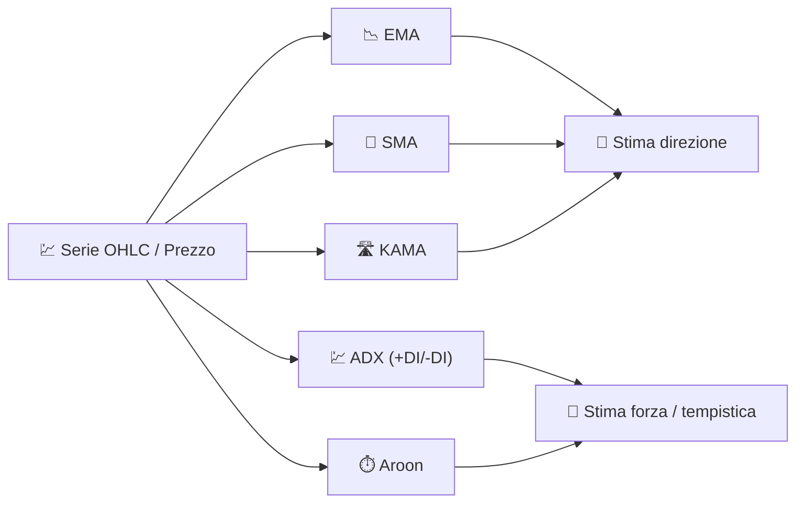

# 🧭 Indicatori di Tendenza

Gli indicatori di tendenza rispondono alla domanda più basilare nell'analisi tecnica: *"in quale direzione sta andando effettivamente il prezzo, una volta filtrato il rumore quotidiano?"* Agiscono tutti come **filtri passa-basso** sulla serie dei prezzi, smussando le fluttuazioni a breve termine per rivelare la direzione sottostante.

---

## 💡 Cosa Misura Questo Gruppo

Un indicatore di tendenza stima la **media locale** del processo dei prezzi (o, per ADX/Aroon, la *forza* e la *tempestività* dei movimenti direzionali). Nessuno di essi predice il futuro; descrivono il passato recente in modo meno rumoroso del prezzo di chiusura grezzo, rendendo più facili da sfruttare i crossover e i cambi di pendenza.

---

## 📋 Indicatori in Questa Categoria

| Indicatore | Cosa Misura | Utilizzo Principale | Dettagli |
|-----------|-------------------|---------|---------|
| **EMA** | Tendenza a ponderazione esponenziale | Rilevamento golden/death cross | [📖](ema.md) |
| **SMA** | Tendenza a ponderazione uguale | Baseline stabile e riferimento per crossover | [📖](sma.md) |
| **KAMA** | Tendenza adattiva basata sull'efficienza | Trend following in regimi laterali vs. tendenziali | [📖](kama.md) |
| **ADX** | *Forza* della tendenza (non direzione) | Filtraggio dei mercati in range | [📖](adx.md) |
| **Aroon** | Tempo dall'ultimo massimo/minimo estremo | Rilevamento della *nascita* di una nuova tendenza | [📖](aroon.md) |

---

## 📥 Requisiti dei Dati

| Indicatore | Input | Note |
|-----------|--------|-------|
| EMA / SMA / KAMA | `close` | Filtri puri di smussamento del prezzo |
| ADX | `high`, `low`, `close` | Necessita di movimento direzionale (`+DM`/`-DM`) e true range |
| Aroon | `high`, `low` | Utilizza solo la *tempistica* degli estremi, non la loro entità |

---

## 🔍 Tabella Comparativa

| Indicatore | Periodo Predefinito | Intervallo Output | Tipo di Filtro |
|-----------|-----------------|---------------|-------------|
| EMA | 14 | Scala del prezzo | IIR (1 polo) |
| SMA | 20 | Scala del prezzo | FIR (finestra rettangolare) |
| KAMA | 10 | Scala del prezzo | IIR adattivo ($\alpha$ variabile) |
| ADX | 14 | 0–100 | Rapporto lisciato del movimento direzionale |
| Aroon | 14 | 0–100 (Su/Giù), −100–100 (Oscillatore) | Contatore del tempo dall'estremo |

!!! info "Direzione vs Forza"

    EMA, SMA e KAMA ti dicono **dove** si trova la tendenza; ADX e Aroon ti dicono **quanto
    convinto dovresti essere dell'esistenza** di una tendenza. Combinare una media mobile
    con l'ADX è un modo classico per evitare falsi segnali nei mercati laterali.

---

## 🔗 Correlati

- 📉 **[Tutti gli Indicatori](index.md)** — Catalogo completo con viste finanziarie e di elaborazione dei segnali
- 💪 **[Indicatori di Momentum](momentum.md)** — Famiglia dei tassi di variazione e degli oscillatori
- 📏 **[Indicatori di Volatilità](volatility.md)** — Dispersione attorno alla tendenza
