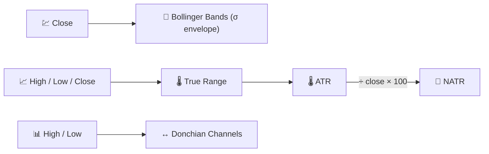

# 📏 Volatility Indicators

Volatility indicators measure the **dispersion** of price around its recent path — how wide the "normal" range of movement has become, regardless of direction.

---

## 💡 What This Group Measures

None of these indicators tell you whether the price will go up or down. They tell you **how much it might move**, which is essential for position sizing, stop-loss placement and detecting the calm-before-the-storm "squeeze" pattern that often precedes a breakout.

---

## 📋 Indicators in This Category

| Indicator | What It Measures | Key Use | Details |
|-----------|-------------------|---------|---------|
| **Bollinger Bands** | Statistical envelope (mean ± $k\sigma$) | Squeeze → breakout detection | [📖](bollinger-bands.md) |
| **ATR** | Average true range, in price units | Stop-loss / position sizing | [📖](atr.md) |
| **NATR** | ATR normalised by price (%) | Comparing volatility across assets | [📖](natr.md) |
| **Donchian Channels** | Rolling highest-high / lowest-low envelope | Breakout systems (Turtle Trading) | [📖](donchian-channels.md) |

---

## 📥 Data Requirements

| Indicator | Inputs | Notes |
|-----------|--------|-------|
| Bollinger Bands | `close` | Standard deviation of the close over the window |
| ATR / NATR | `high`, `low`, `close` | Built on the **True Range**, which needs the previous close |
| Donchian Channels | `high`, `low` | Pure extrema tracker, no averaging |

---

## 🔍 Comparison Table

| Indicator | Default Period | Output Units | Envelope Shape |
|-----------|-----------------|---------------|-----------------|
| Bollinger Bands | 20 (×2σ) | Price | Statistical (mean ± σ) |
| ATR | 14 | Price | Single line (no envelope) |
| NATR | 14 | % of price | Single line (no envelope) |
| Donchian Channels | 20 | Price | Extremal (highest-high / lowest-low) |

!!! note "Absolute vs relative volatility"

    ATR and Bollinger Bands report volatility in the asset's own **price units** —
    comparing a €5 ATR on a €50 stock with a €5 ATR on a €500 stock is misleading.
    NATR solves this by expressing the same information as a **percentage**, making
    cross-asset volatility screens meaningful.

---

## 🔗 Related

- 📉 **[All Indicators](index.md)** — Full catalogue with financial and signal-processing views
- 🧭 **[Trend Indicators](trend.md)** — Direction of the move volatility surrounds
- 📦 **[Volume Indicators](volume.md)** — Confirmation via trading activity
