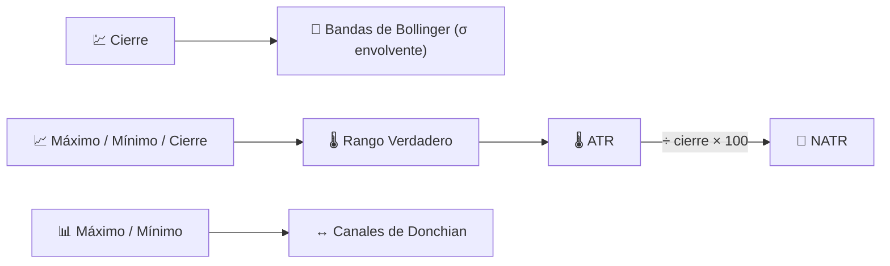

# 📏 Indicadores de Volatilidad

Los indicadores de volatilidad miden la **dispersión** del precio alrededor de su trayectoria reciente — cuán amplio se ha vuelto el rango "normal" de movimiento, independientemente de la dirección.

---

## 💡 Qué Mide Este Grupo

Ninguno de estos indicadores indica si el precio subirá o bajará. Te indican **cuánto podría moverse**, lo cual es esencial para el dimensionamiento de posiciones, la colocación de stop-loss y la detección del patrón de "compresión" (squeeze) de calma-antes-de-la-tormenta que a menudo precede a una ruptura.

---

## 📋 Indicadores en Esta Categoría

| Indicador | Qué Mide | Uso Clave | Detalles |
|-----------|----------|-----------|----------|
| **Bollinger Bands** | Envolvente estadística (media ± $k\sigma$) | Detección de compresión → ruptura | [📖](bollinger-bands.md) |
| **ATR** | Rango Verdadero Promedio, en unidades de precio | Stop-loss / dimensionamiento de posición | [📖](atr.md) |
| **NATR** | ATR normalizado por precio (%) | Comparación de volatilidad entre activos | [📖](natr.md) |
| **Donchian Channels** | Envolvente de máximo-más-alto / mínimo-más-bajo móvil | Sistemas de ruptura (Turtle Trading) | [📖](donchian-channels.md) |

---

## 📥 Requisitos de Datos

| Indicador | Entradas | Notas |
|-----------|----------|-------|
| Bollinger Bands | `close` | Desviación estándar del cierre en la ventana |
| ATR / NATR | `high`, `low`, `close` | Basado en el **True Range**, que necesita el cierre anterior |
| Donchian Channels | `high`, `low` | Rastreador de extremos puros, sin promediado |

---

## 🔍 Tabla Comparativa

| Indicador | Período por Defecto | Unidades de Salida | Forma de la Envolvente |
|-----------|---------------------|--------------------|------------------------|
| Bollinger Bands | 20 (×2σ) | Precio | Estadística (media ± σ) |
| ATR | 14 | Precio | Línea única (sin envolvente) |
| NATR | 14 | % del precio | Línea única (sin envolvente) |
| Donchian Channels | 20 | Precio | Extremal (máximo-más-alto / mínimo-más-bajo) |

!!! note "Volatilidad absoluta vs relativa"

    ATR y Bollinger Bands reportan la volatilidad en las **unidades de precio** propias del activo —
    comparar un ATR de €5 en una acción de €50 con un ATR de €5 en una acción de €500 es engañoso.
    NATR resuelve esto expresando la misma información como un **porcentaje**, lo que hace que
    los análisis de volatilidad entre activos sean significativos.

---

## 🔗 Relacionados

- 📉 **[Todos los Indicadores](index.md)** — Catálogo completo con perspectivas financieras y de procesamiento de señal
- 🧭 **[Indicadores de Tendencia](trend.md)** — Dirección del movimiento que rodea la volatilidad
- 📦 **[Indicadores de Volumen](volume.md)** — Confirmación mediante actividad de negociación
