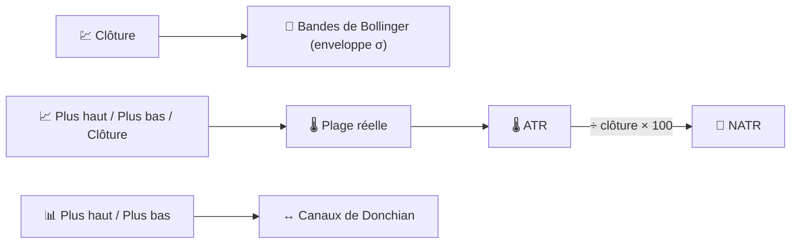

# 📏 Indicateurs de volatilité

Les indicateurs de volatilité mesurent la **dispersion** du prix autour de sa trajectoire récente — à quel point la fourchette « normale » de mouvement s'est élargie, quelle que soit la direction.

---

## 💡 Ce que mesure ce groupe

Aucun de ces indicateurs ne vous dit si le prix va monter ou descendre. Ils vous disent **de combien il pourrait bouger**, ce qui est essentiel pour le dimensionnement des positions, le placement des stop-loss et la détection du motif de « resserrement » (calme avant la tempête) qui précède souvent une cassure.

---

## 📋 Indicateurs de cette catégorie

| Indicateur | Ce qu'il mesure | Utilisation clé | Détails |
|-----------|-------------------|---------|---------|
| **Bandes de Bollinger** | Enveloppe statistique (moyenne ± $k\sigma$) | Détection de resserrement → cassure | [📖](bollinger-bands.md) |
| **ATR** | Plage réelle moyenne, en unités de prix | Stop-loss / dimensionnement des positions | [📖](atr.md) |
| **NATR** | ATR normalisé par le prix (%) | Comparaison de la volatilité entre actifs | [📖](natr.md) |
| **Canaux de Donchian** | Enveloppe glissante de plus haut / plus bas | Systèmes de cassure (Turtle Trading) | [📖](donchian-channels.md) |

---

## 📥 Exigences en matière de données

| Indicateur | Entrées | Remarques |
|-----------|--------|-------|
| Bandes de Bollinger | `close` | Écart type du cours de clôture sur la fenêtre |
| ATR / NATR | `high`, `low`, `close` | Basés sur la **Plage réelle**, qui nécessite la clôture précédente |
| Canaux de Donchian | `high`, `low` | Pur suivi des extrêmes, sans moyennage |

---

## 🔍 Tableau comparatif

| Indicateur | Période par défaut | Unités de sortie | Forme de l'enveloppe |
|-----------|-----------------|---------------|-----------------|
| Bandes de Bollinger | 20 (×2σ) | Prix | Statistique (moyenne ± σ) |
| ATR | 14 | Prix | Ligne unique (pas d'enveloppe) |
| NATR | 14 | % du prix | Ligne unique (pas d'enveloppe) |
| Canaux de Donchian | 20 | Prix | Extrémale (plus haut / plus bas) |

!!! note "Volatilité absolue vs relative"

    L'ATR et les bandes de Bollinger rapportent la volatilité dans les **unités de prix** propres à l'actif —
    comparer un ATR de 5 € sur une action à 50 € avec un ATR de 5 € sur une action à 500 € est trompeur.
    Le NATR résout ce problème en exprimant la même information sous forme de **pourcentage**, rendant
    pertinentes les comparaisons de volatilité entre actifs.

---

## 🔗 Liens connexes

- 📉 **[Tous les indicateurs](index.md)** — Aperçu complet avec les vues financière et de traitement du signal
- 🧭 **[Indicateurs de tendance](trend.md)** — Direction du mouvement que la volatilité entoure
- 📦 **[Indicateurs de volume](volume.md)** — Confirmation par l'activité de négociation
