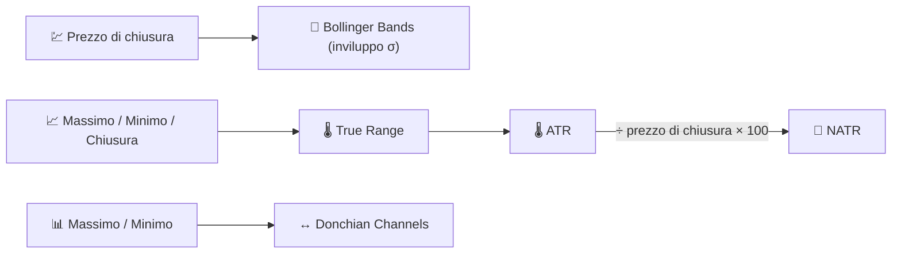

# 📏 Indicatori di Volatilità

Gli indicatori di volatilità misurano la **dispersione** del prezzo attorno al suo percorso recente — quanto ampio è diventato il range "normale" di movimento, indipendentemente dalla direzione.

---

## 💡 Cosa Misura Questo Gruppo

Nessuno di questi indicatori ti dice se il prezzo salirà o scenderà. Ti dicono **quanto potrebbe muoversi**, il che è essenziale per il dimensionamento della posizione, il posizionamento degli stop-loss e per rilevare il pattern di "squeeze" (calma prima della tempesta) che spesso precede un breakout.

---

## 📋 Indicatori in Questa Categoria

| Indicatore | Cosa Misura | Utilizzo Principale | Dettagli |
|------------|-------------|---------------------|----------|
| **Bollinger Bands** | Inviluppo statistico (media ± $k\sigma$) | Rilevamento squeeze → breakout | [📖](bollinger-bands.md) |
| **ATR** | Intervallo medio reale, in unità di prezzo | Stop-loss / dimensionamento posizione | [📖](atr.md) |
| **NATR** | ATR normalizzato per il prezzo (%) | Confronto volatilità tra asset | [📖](natr.md) |
| **Donchian Channels** | Inviluppo del massimo più alto / minimo più basso mobile | Sistemi di breakout (Turtle Trading) | [📖](donchian-channels.md) |

---

## 📥 Requisiti dei Dati

| Indicatore | Input | Note |
|------------|-------|------|
| Bollinger Bands | `close` | Deviazione standard del prezzo di chiusura sulla finestra |
| ATR / NATR | `high`, `low`, `close` | Basato sul **True Range**, che necessita della chiusura precedente |
| Donchian Channels | `high`, `low` | Rilevatore puro di estremi, nessuna media |

---

## 🔍 Tabella Comparativa

| Indicatore | Periodo Predefinito | Unità di Output | Forma dell'Inviluppo |
|------------|----------------------|-----------------|-----------------------|
| Bollinger Bands | 20 (×2σ) | Prezzo | Statistico (media ± σ) |
| ATR | 14 | Prezzo | Linea singola (nessun inviluppo) |
| NATR | 14 | % del prezzo | Linea singola (nessun inviluppo) |
| Donchian Channels | 20 | Prezzo | Estremo (massimo più alto / minimo più basso) |

!!! note "Volatilità assoluta vs. relativa"

    ATR e Bollinger Bands riportano la volatilità nelle **unità di prezzo** proprie dell'asset —
    confrontare un ATR di €5 su un'azione del valore di €50 con un ATR di €5 su un titolo da €500 è fuorviante.
    NATR risolve questo problema esprimendo le stesse informazioni in **percentuale**, rendendo
    significativi i confronti di volatilità tra asset.

---

## 🔗 Correlati

- 📉 **[Tutti gli Indicatori](index.md)** — Catalogo completo con viste finanziarie e di elaborazione del segnale
- 🧭 **[Indicatori di Trend](trend.md)** — Direzione del movimento che la volatilità circonda
- 📦 **[Indicatori di Volume](volume.md)** — Conferma tramite attività di trading
