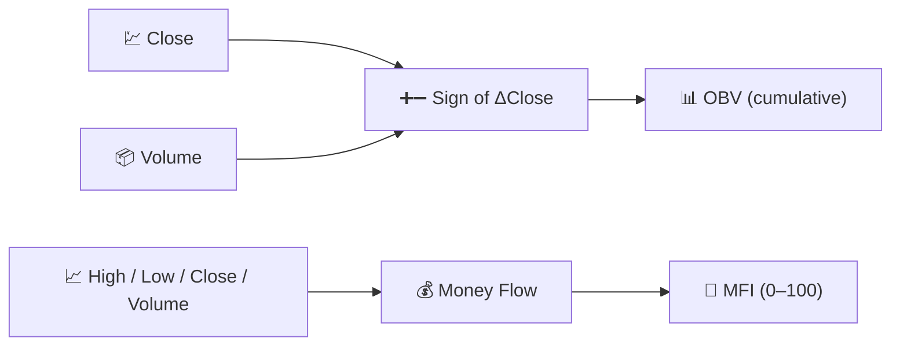

# 📦 Volume Indicators

Volume indicators fold **trading activity** into the analysis. Price tells you *what* happened; volume tells you *how convinced* the market was while it happened.

---

## 💡 What This Group Measures

A price move on high volume reflects broad participation and is more likely to persist; the same move on thin volume is fragile. Volume indicators combine price direction with traded quantity to build a running measure of buying or selling pressure that price alone cannot reveal.

---

## 📋 Indicators in This Category

| Indicator | What It Measures | Key Use | Details |
|-----------|-------------------|---------|---------|
| **OBV** | Cumulative volume, signed by price direction | Trend confirmation / divergence | [📖](obv.md) |
| **MFI** | "Volume-weighted RSI" | Overbought/oversold with volume confirmation | [📖](mfi.md) |

---

## 📥 Data Requirements

| Indicator | Inputs | Notes |
|-----------|--------|-------|
| OBV | `close`, `volume` | Only the *sign* of the price change matters, not its size |
| MFI | `high`, `low`, `close`, `volume` | Uses the *typical price* $(H+L+C)/3$ weighted by volume |

---

## 🔍 Comparison Table

| Indicator | Default Period | Output Range | Uses Price Magnitude? |
|-----------|-----------------|---------------|------------------------|
| OBV | — (no lookback) | Unbounded, rebased to 0 at range start | No (sign only) |
| MFI | 14 | 0–100 | Yes (typical price × volume) |

!!! info "OBV has no period parameter"

    Unlike every other indicator in LibreFolio, OBV takes **no configurable
    parameters** — it is a pure running sum. LibreFolio rebases the displayed series
    to zero at the start of the requested chart range, so only the *shape* of the
    curve (its slope and divergences from price) is meaningful, not its absolute level.

---

## 🔗 Related

- 📉 **[All Indicators](index.md)** — Full catalogue with financial and signal-processing views
- 💪 **[Momentum Indicators](momentum.md)** — Oscillators MFI is closely related to
- 📏 **[Volatility Indicators](volatility.md)** — Dispersion, independent of volume
