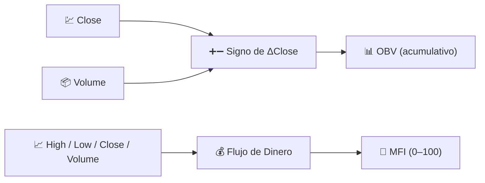

# 📦 Indicadores de Volumen

Los indicadores de volumen incorporan la **actividad de negociación** al análisis. El precio te dice *qué* sucedió; el volumen te indica *qué tan convencido* estaba el mercado mientras ocurría.

---

## 💡 Qué Mide Este Grupo

Un movimiento de precio con alto volumen refleja una amplia participación y es más probable que persista; el mismo movimiento con bajo volumen es frágil. Los indicadores de volumen combinan la dirección del precio con la cantidad negociada para construir una medida acumulativa de presión compradora o vendedora que el precio por sí solo no puede revelar.

---

## 📋 Indicadores en Esta Categoría

| Indicador | Qué Mide | Uso Clave | Detalles |
|-----------|----------|-----------|----------|
| **OBV** | Volumen acumulado, con signo según la dirección del precio | Confirmación de tendencia / divergencia | [📖](obv.md) |
| **MFI** | "RSI ponderado por volumen" | Sobrecompra/sobreventa con confirmación de volumen | [📖](mfi.md) |

---

## 📥 Requisitos de Datos

| Indicador | Entradas | Notas |
|-----------|----------|-------|
| OBV | `close`, `volume` | Solo importa el *signo* del cambio de precio, no su magnitud |
| MFI | `high`, `low`, `close`, `volume` | Utiliza el *precio típico* $(H+L+C)/3$ ponderado por el volumen |

---

## 🔍 Tabla Comparativa

| Indicador | Período Predeterminado | Rango de Salida | ¿Usa la Magnitud del Precio? |
|-----------|------------------------|-----------------|------------------------------|
| OBV | — (sin período de retrospectiva) | Sin límite, reiniciado a 0 al inicio del rango | No (solo signo) |
| MFI | 14 | 0–100 | Sí (precio típico × volumen) |

!!! info "OBV no tiene parámetro de período"

    A diferencia de cualquier otro indicador en LibreFolio, OBV no requiere
    **parámetros configurables** — es una suma acumulativa pura. LibreFolio
    reinicia la serie mostrada a cero al inicio del rango de gráfico solicitado,
    por lo que solo la *forma* de la curva (su pendiente y divergencias del precio)
    es significativa, no su nivel absoluto.

---

## 🔗 Relacionado

- 📉 **[Todos los Indicadores](index.md)** — Catálogo completo con vistas financieras y de procesamiento de señales
- 💪 **[Indicadores de Momentum](momentum.md)** — Osciladores con los que MFI está estrechamente relacionado
- 📏 **[Indicadores de Volatilidad](volatility.md)** — Dispersión, independiente del volumen
