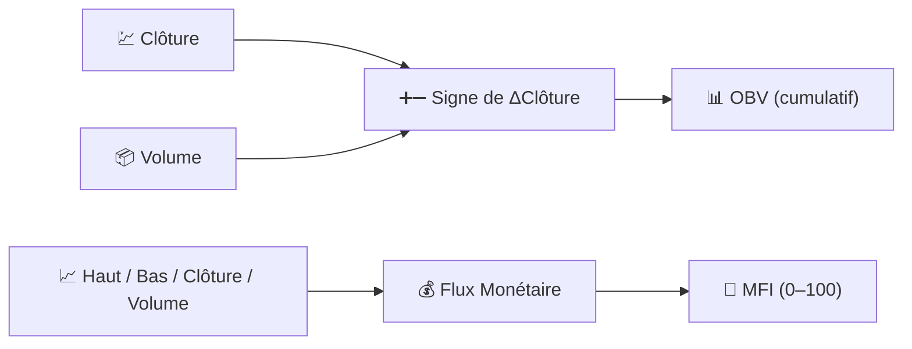

# 📦 Indicateurs de Volume

Les indicateurs de volume intègrent **l'activité de trading** dans l'analyse. Le prix vous indique *ce qui* s'est passé ; le volume vous indique *à quel point* le marché était convaincu pendant l'événement.

---

## 💡 Ce que ce groupe mesure

Un mouvement de prix sur un volume élevé reflète une participation étendue et a plus de chances de persister ; le même mouvement sur un volume faible est fragile. Les indicateurs de volume combinent la direction du prix avec la quantité échangée pour construire une mesure continue de la pression d'achat ou de vente que le seul prix ne peut révéler.

---

## 📋 Indicateurs de cette catégorie

| Indicateur | Ce qu'il mesure | Utilisation clé | Détails |
|------------|-----------------|-----------------|---------|
| **OBV** | Volume cumulé, signé par la direction du prix | Confirmation de tendance / divergence | [📖](obv.md) |
| **MFI** | « RSI pondéré par le volume » | Surachat / survente avec confirmation par le volume | [📖](mfi.md) |

---

## 📥 Données requises

| Indicateur | Entrées | Remarques |
|------------|---------|-----------|
| OBV | `close`, `volume` | Seul le *signe* du changement de prix importe, pas son ampleur |
| MFI | `high`, `low`, `close`, `volume` | Utilise le *prix typique* $(H+L+C)/3$ pondéré par le volume |

---

## 🔍 Tableau comparatif

| Indicateur | Période par défaut | Plage de sortie | Utilise l'ampleur du prix ? |
|------------|--------------------|-----------------|-----------------------------|
| OBV | — (pas de période) | Illimitée, ramenée à 0 au début de la plage | Non (signe uniquement) |
| MFI | 14 | 0–100 | Oui (prix typique × volume) |

!!! info "OBV n'a pas de paramètre de période"

    Contrairement à tous les autres indicateurs de LibreFolio, OBV ne prend **aucun paramètre
    configurable** — c'est une simple somme cumulée. LibreFolio ramène la série affichée
    à zéro au début de la plage de graphique demandée, donc seule la *forme* de la
    courbe (sa pente et ses divergences par rapport au prix) est significative, pas son niveau absolu.

---

## 🔗 Liens connexes

- 📉 **[Tous les indicateurs](index.md)** — Catalogue complet avec vues financières et de traitement du signal
- 💪 **[Indicateurs de Momentum](momentum.md)** — Oscillateurs auxquels le MFI est étroitement lié
- 📏 **[Indicateurs de Volatilité](volatility.md)** — Dispersion, indépendante du volume
