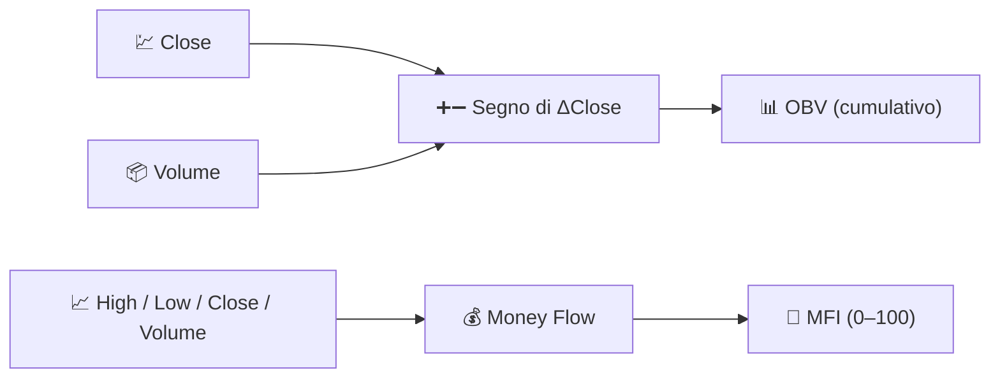

# 📦 Indicatori di Volume

Gli indicatori di volume integrano **l'attività di trading** nell'analisi. Il prezzo ti dice *cosa* è successo; il volume ti dice *quanto fosse convinto* il mercato mentre accadeva.

---

## 💡 Cosa Misura Questo Gruppo

Un movimento di prezzo su volume elevato riflette una partecipazione diffusa ed è più probabile che persista; lo stesso movimento su volume scarso è fragile. Gli indicatori di volume combinano la direzione del prezzo con la quantità scambiata per costruire una misura continua della pressione di acquisto o vendita che il solo prezzo non può rivelare.

---

## 📋 Indicatori in Questa Categoria

| Indicatore | Cosa Misura | Utilizzo Principale | Dettagli |
|-----------|-------------------|---------|---------|
| **OBV** | Volume cumulativo, firmato dalla direzione del prezzo | Conferma di tendenza / divergenza | [📖](obv.md) |
| **MFI** | "RSI ponderato per il volume" | Ipercomprato/ipervenduto con conferma del volume | [📖](mfi.md) |

---

## 📥 Requisiti dei Dati

| Indicatore | Input | Note |
|-----------|--------|-------|
| OBV | `close`, `volume` | Solo il *segno* della variazione di prezzo conta, non la sua entità |
| MFI | `high`, `low`, `close`, `volume` | Utilizza il *prezzo tipico* $(H+L+C)/3$ ponderato per il volume |

---

## 🔍 Tabella Comparativa

| Indicatore | Periodo Predefinito | Intervallo di Uscita | Utilizza l'Entità del Prezzo? |
|-----------|-----------------|---------------|------------------------|
| OBV | — (nessun lookback) | Illimitato, azzerato a 0 all'inizio dell'intervallo | No (solo segno) |
| MFI | 14 | 0–100 | Sì (prezzo tipico × volume) |

!!! info "OBV non ha un parametro di periodo"

    A differenza di ogni altro indicatore in LibreFolio, OBV non accetta **parametri
    configurabili** — è una pura somma cumulativa. LibreFolio azzera la serie
    visualizzata a zero all'inizio dell'intervallo di grafico richiesto, quindi solo la
    *forma* della curva (la sua pendenza e le divergenze dal prezzo) è significativa, non il suo livello assoluto.

---

## 🔗 Correlati

- 📉 **[Tutti gli Indicatori](index.md)** — Catalogo completo con viste finanziarie e di elaborazione dei segnali
- 💪 **[Indicatori di Momentum](momentum.md)** — Oscillatori a cui MFI è strettamente correlato
- 📏 **[Indicatori di Volatilità](volatility.md)** — Dispersione, indipendente dal volume
