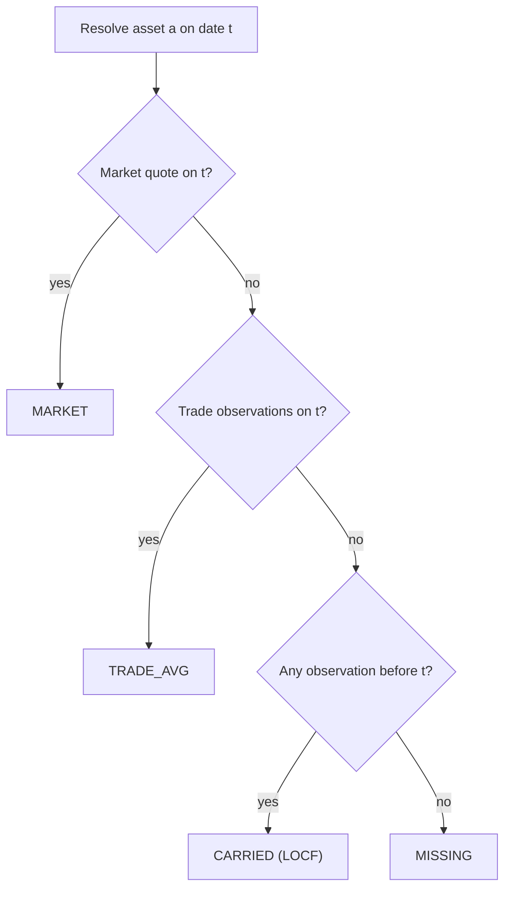

# 🧭 Price Resolution

## 💡 Purpose

LibreFolio uses one unified resolver as the primary valuation source for open positions, NAV, lot valuation, chart price lines, and data-quality flags. The resolver answers one daily question:

$$
\operatorname{mark}(a,t)=\text{best known native-currency unit mark for asset }a\text{ on date }t
$$

It is implemented by `AssetPriceSeries.resolve(t)` and built from two observation classes:

- `MARKET`: asset-system `PriceHistory.close`
- `TRADE`: transaction-implied prices from BUY/SELL and priced ADJUSTMENT rows

## 🧮 Daily Tier Cascade

For each asset and date, observations are collapsed to one mark per day:

$$
\operatorname{mark}(a,t)=
\begin{cases}
\text{MARKET}(a,t), & \text{same-day market quote exists}\\
\operatorname{avg}\bigl(\text{TRADE}(a,t)\bigr), & \text{same-day trade observations exist}\\
\text{last observation before }t, & \text{otherwise, if any}\\
\varnothing, & \text{otherwise}
\end{cases}
$$

The public engine schema maps resolver marks to valuation-source labels:

| Resolver source | Origin | Portfolio valuation source |
|-----------------|--------|----------------------------|
| `MARKET` | Same-day real quote | `MARKET_PRICE` |
| `TRADE_AVG` | Same-day transaction mark | `LAST_TRADE_PRICE` |
| `CARRIED` from MARKET | Stale real quote | `MARKET_PRICE` |
| `CARRIED` from TRADE | Stale transaction mark | `LAST_TRADE_PRICE` |
| `MISSING` | No observation on or before date | `MISSING` |

!!! warning "No legacy cascade"

    Current shipped code does **not** use a separate `market → last BUY → seed cost` valuation path. Trade-origin marks are observations inside the unified resolver; WAC remains cost basis, not valuation price.

## 🌍 Currency and Scale

Resolver marks stay in their **native currency**. Consumers convert the mark at the **valuation date**:

$$
\mathrm{Price}_{C^*}(a,t)=\operatorname{mark}(a,t)\cdot \mathrm{fx}\bigl(\mathrm{ccy}_{mark}, C^*, t\bigr)
$$

This matters for carried marks: a quote or trade observed on $s<t$ is translated using FX at $t$, not FX at $s$.

Cost basis uses different timing. Acquisition cost is pinned to the transaction date:

$$
\mathrm{Cost}_{C^*}(\tau)=\mathrm{Cost}_{native}(\tau)\cdot \mathrm{fx}\bigl(\mathrm{ccy}_{cost}, C^*, \tau\bigr)
$$

All resolver observations live on the market quote axis, including `quote_base_quantity`:

$$
\mathrm{HoldingValue}(q,p,qbq)=\frac{q}{qbq}\cdot p
$$

BUY/SELL unit prices and priced ADJUSTMENT overrides are multiplied by `quote_base_quantity` before entering the resolver, so bond-like assets quoted per 100 nominal units compare on the same axis as `PriceHistory.close`.

## 🏷️ Estimated and Stale

`estimated=True` means the resolved value is TRADE-origin:

$$
\mathrm{estimated}(a,t) \iff \mathrm{origin}(\operatorname{mark}(a,t))=\text{TRADE}
$$

A carried real market quote is stale but **not** estimated. Staleness is represented separately through `BackwardFillInfo`:

$$
\mathrm{days\_back}=t-\mathrm{as\_of\_date}
$$

`price_backward_fill.actual_rate_date` stores the observation date and `days_back` stores the LOCF age. Portfolio data-quality warnings evaluate the valuation-date state, not a historical union of all past carried/estimated days.

## ⚠️ Missing Marks

`MISSING` means there is no market or trade observation on or before the valuation date. In the portfolio engine, that position cannot contribute market value until a mark exists. In lots analysis, estimated-at-cost mode can still value open lots at cost when the asset has no market price series at all; see [FIFO Lot Analysis](../fifo-engine/fifo-lot-analysis.md#estimated-at-cost).

Portfolio warnings are evaluated **as of the valuation date**. Trade-origin valuations older than the 14-day grace period feed the “assets valued at cost / no market price for more than two weeks” warning; an asset that later receives a real market quote clears the warning.

## 🔗 Related

- 💼 [NAV](nav.md) — consumes resolver marks for market value
- 📖 [Book Value](book-value.md) — cost-basis side, independent from marks
- 📈 [Net Annualized Return](net-annualized-return.md) — annualizes returns built on resolver valuations
- ⚙️ [Portfolio Engine](index.md) — full model
