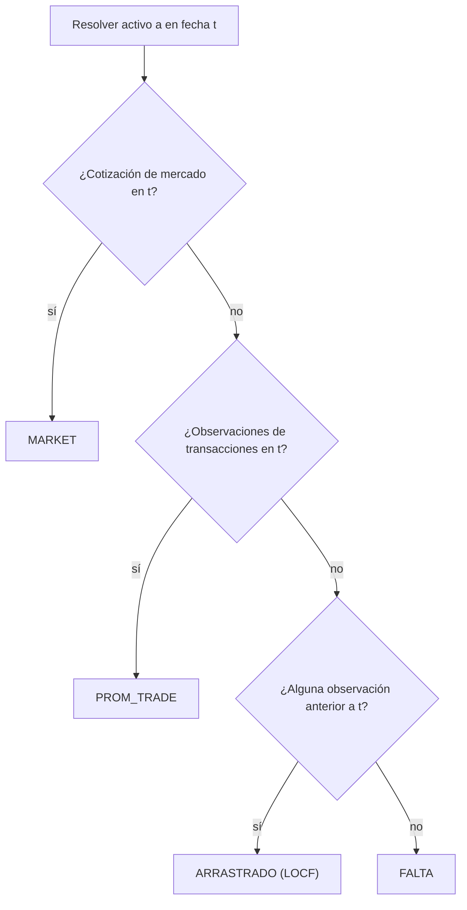

# 🧭 Resolución de Precios

## 💡 Propósito

LibreFolio utiliza un único resolutor unificado como fuente de valoración principal para posiciones abiertas, NAV, valoración de lotes, líneas de precio en gráficos e indicadores de calidad de datos. El resolutor responde a una pregunta diaria:

$$
\operatorname{mark}(a,t)=\text{mejor precio unitario conocido en moneda local para el activo }a\text{ en la fecha }t
$$

Está implementado por `AssetPriceSeries.resolve(t)` y se construye a partir de dos clases de observación:

- `MARKET`: `PriceHistory.close` del sistema-activo
- `TRADE`: precios implícitos de transacciones provenientes de filas COMPRA/VENTA y AJUSTE con precio

## 🧮 Cascada Diaria por Niveles

Para cada activo y fecha, las observaciones se reducen a un único precio por día:

$$
\operatorname{mark}(a,t)=
\begin{cases}
\text{MARKET}(a,t), & \text{existe cotización de mercado del mismo día}\\
\operatorname{promedio}\bigl(\text{TRADE}(a,t)\bigr), & \text{existen observaciones de transacciones del mismo día}\\
\text{última observación anterior a }t, & \text{en caso contrario, si existe alguna}\\
\varnothing, & \text{en caso contrario}
\end{cases}
$$

El esquema público del motor asigna los precios del resolutor a etiquetas de fuente de valoración:

| Fuente del resolutor | Origen | Fuente de valoración de la cartera |
|----------------------|--------|-------------------------------------|
| `MARKET` | Cotización real del mismo día | `PRECIO_MERCADO` |
| `PROM_TRADE` | Precio de transacción del mismo día | `ULTIMO_PRECIO_TRANSACCION` |
| `ARRASTRADO` desde MARKET | Cotización real obsoleta | `PRECIO_MERCADO` |
| `ARRASTRADO` desde TRADE | Precio de transacción obsoleto | `ULTIMO_PRECIO_TRANSACCION` |
| `FALTA` | Sin observación en la fecha o anterior | `FALTA` |

!!! warning "Sin cascada heredada"

    El código actual distribuido **no** utiliza una ruta de valoración separada de `mercado → última COMPRA → costo inicial`. Los precios de origen de transacciones son observaciones dentro del resolutor unificado; el PMP sigue siendo la base del costo, no el precio de valoración.

## 🌍 Moneda y Escala

Los precios del resolutor se mantienen en su **moneda local**. Los consumidores convierten el precio en la **fecha de valoración**:

$$
\mathrm{Precio}_{C^*}(a,t)=\operatorname{mark}(a,t)\cdot \mathrm{fx}\bigl(\mathrm{moneda}_{marca}, C^*, t\bigr)
$$

Esto es importante para los precios arrastrados: una cotización o transacción observada en $s<t$ se traduce utilizando el tipo de cambio en $t$, no el tipo de cambio en $s$.

La base del costo utiliza una temporalidad diferente. El costo de adquisición se fija en la fecha de la transacción:

$$
\mathrm{Costo}_{C^*}(\tau)=\mathrm{Costo}_{local}(\tau)\cdot \mathrm{fx}\bigl(\mathrm{moneda}_{costo}, C^*, \tau\bigr)
$$

Todas las observaciones del resolutor residen en el eje de cotización de mercado, incluyendo `quote_base_quantity`:

$$
\mathrm{ValorParticipacion}(q,p,qbq)=\frac{q}{qbq}\cdot p
$$

Los precios unitarios de COMPRA/VENTA y las sobreescrituras de AJUSTE con precio se multiplican por `quote_base_quantity` antes de ingresar al resolutor, de modo que los activos similares a bonos cotizados por cada 100 unidades nominales se comparen en el mismo eje que `PriceHistory.close`.

## 🏷️ Estimado y Obsoleto

`estimated=True` significa que el valor resuelto tiene origen TRADE:

$$
\mathrm{estimado}(a,t) \iff \mathrm{origen}(\operatorname{mark}(a,t))=\text{TRADE}
$$

Una cotización de mercado real arrastrada está obsoleta pero **no** estimada. La obsolescencia se representa por separado a través de `BackwardFillInfo`:

$$
\mathrm{dias\_atras}=t-\mathrm{as\_of\_date}
$$

`price_backward_fill.actual_rate_date` almacena la fecha de observación y `days_back` almacena la antigüedad del LOCF. Las advertencias de calidad de datos de la cartera evalúan el estado en la fecha de valoración, no una unión histórica de todos los días arrastrados/estimados pasados.

## ⚠️ Precios Faltantes

`FALTA` significa que no hay ninguna observación de mercado o transacción en la fecha de valoración o antes. En el motor de cartera, esa posición no puede contribuir al valor de mercado hasta que exista un precio. En el análisis de lotes, el modo estimado al costo aún puede valorar los lotes abiertos al costo cuando el activo no tiene ninguna serie de precios de mercado; consulte [Análisis de Lotes FIFO](../fifo-engine/fifo-lot-analysis.md#estimated-at-cost).

Las advertencias de la cartera se evalúan **a partir de la fecha de valoración**. Las valoraciones de origen de transacciones con más de 14 días de antigüedad alimentan la advertencia "activos valorados al costo / sin precio de mercado durante más de dos semanas"; un activo que posteriormente recibe una cotización de mercado real elimina la advertencia.

## 🔗 Relacionado

- 💼 [NAV](nav.md) — consume los precios del resolutor para el valor de mercado
- 📖 [Valor Contable](book-value.md) — lado de la base del costo, independiente de los precios
- 📈 [Rendimiento Neto Anualizado](net-annualized-return.md) — anualiza los rendimientos construidos sobre las valoraciones del resolutor
- ⚙️ [Motor de Cartera](index.md) — modelo completo
