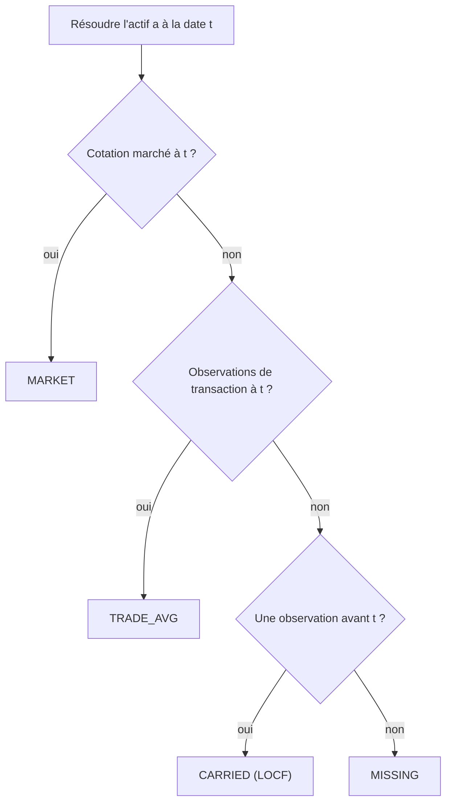

# 🧭 Résolution de Prix

## 💡 Objectif

LibreFolio utilise un moteur de résolution unifié comme source d'évaluation principale pour les positions ouvertes, la VNI, l'évaluation des lots, les lignes de prix des graphiques et les indicateurs de qualité des données. Le résolveur répond à une question quotidienne :

$$
\operatorname{mark}(a,t)=\text{meilleur cours unitaire connu en devise native pour l'actif }a\text{ à la date }t
$$

Il est implémenté par `AssetPriceSeries.resolve(t)` et construit à partir de deux classes d'observations :

- `MARKET` : `PriceHistory.close` du système d'actif
- `TRADE` : prix implicites des transactions provenant des lignes ACHAT/VENTE et des lignes AJUSTEMENT valorisées

## 🧮 Cascade Quotidienne par Niveaux

Pour chaque actif et chaque date, les observations sont réduites à un seul cours par jour :

$$
\operatorname{mark}(a,t)=
\begin{cases}
\text{MARKET}(a,t), & \text{une cotation du marché du jour existe}\\
\operatorname{avg}\bigl(\text{TRADE}(a,t)\bigr), & \text{des observations de transaction du jour existent}\\
\text{dernière observation avant }t, & \text{sinon, s'il y en a une}\\
\varnothing, & \text{sinon}
\end{cases}
$$

Le schéma public du moteur fait correspondre les marques du résolveur aux étiquettes de source d'évaluation :

| Source du résolveur | Origine | Source d'évaluation du portefeuille |
|---------------------|---------|-------------------------------------|
| `MARKET` | Cotation réelle du jour | `MARKET_PRICE` |
| `TRADE_AVG` | Marque de transaction du jour | `LAST_TRADE_PRICE` |
| `CARRIED` de MARKET | Cotation réelle obsolète | `MARKET_PRICE` |
| `CARRIED` de TRADE | Marque de transaction obsolète | `LAST_TRADE_PRICE` |
| `MISSING` | Aucune observation à la date ou avant | `MISSING` |

!!! warning "Absence de cascade héritée"

    Le code actuellement fourni n'utilise **pas** un chemin d'évaluation séparé `marché → dernier ACHAT → coût initial`. Les marques issues de transactions sont des observations dans le résolveur unifié ; le PMP reste la base de coût, et non le prix d'évaluation.

## 🌍 Devise et Échelle

Les marques du résolveur restent dans leur **devise native**. Les consommateurs convertissent la marque à la **date d'évaluation** :

$$
\mathrm{Price}_{C^*}(a,t)=\operatorname{mark}(a,t)\cdot \mathrm{fx}\bigl(\mathrm{ccy}_{mark}, C^*, t\bigr)
$$

Ceci est important pour les marques reportées : une cotation ou transaction observée à $s<t$ est convertie en utilisant le taux de change à $t$, et non le taux de change à $s$.

La base de coût utilise une temporalité différente. Le coût d'acquisition est lié à la date de transaction :

$$
\mathrm{Cost}_{C^*}(\tau)=\mathrm{Cost}_{native}(\tau)\cdot \mathrm{fx}\bigl(\mathrm{ccy}_{cost}, C^*, \tau\bigr)
$$

Toutes les observations du résolveur se situent sur l'axe de cotation du marché, y compris `quote_base_quantity` :

$$
\mathrm{HoldingValue}(q,p,qbq)=\frac{q}{qbq}\cdot p
$$

Les prix unitaires ACHAT/VENTE et les surcharges d'AJUSTEMENT valorisées sont multipliés par `quote_base_quantity` avant d'entrer dans le résolveur, de sorte que les actifs de type obligataire cotés pour 100 unités nominales se comparent sur le même axe que `PriceHistory.close`.

## 🏷️ Estimé et Obsolète

`estimated=True` signifie que la valeur résolue provient de TRADE :

$$
\mathrm{estimated}(a,t) \iff \mathrm{origin}(\operatorname{mark}(a,t))=\text{TRADE}
$$

Un cours de marché réel reporté est obsolète mais **pas** estimé. L'obsolescence est représentée séparément via `BackwardFillInfo` :

$$
\mathrm{days\_back}=t-\mathrm{as\_of\_date}
$$

`price_backward_fill.actual_rate_date` stocke la date d'observation et `days_back` stocke l'âge du LOCF. Les avertissements de qualité des données du portefeuille évaluent l'état à la date d'évaluation, et non une union historique de tous les jours reportés/estimés.

## ⚠️ Cours Manquants

`MISSING` signifie qu'il n'y a aucune observation de marché ou de transaction à la date d'évaluation ou avant. Dans le moteur de portefeuille, cette position ne peut pas contribuer à la valeur de marché jusqu'à ce qu'un cours existe. Dans l'analyse des lots, le mode estimé au coût peut toujours valoriser les lots ouverts au coût lorsque l'actif n'a aucune série de prix de marché du tout ; voir [Analyse des Lots FIFO](../fifo-engine/fifo-lot-analysis.md#estimated-at-cost).

Les avertissements du portefeuille sont évalués **à la date d'évaluation**. Les valorisations issues de transactions datant de plus de 14 jours alimentent l'avertissement « actifs valorisés au coût / aucun prix de marché depuis plus de deux semaines » ; un actif qui reçoit ultérieurement un cours de marché réel efface l'avertissement.

## 🔗 Liens connexes

- 💼 [VNI](nav.md) — consomme les marques du résolveur pour la valeur de marché
- 📖 [Valeur Comptable](book-value.md) — côté base de coût, indépendant des marques
- 📈 [Rendement Annualisé Net](net-annualized-return.md) — annualise les rendements basés sur les évaluations du résolveur
- ⚙️ [Moteur de Portefeuille](index.md) — modèle complet
