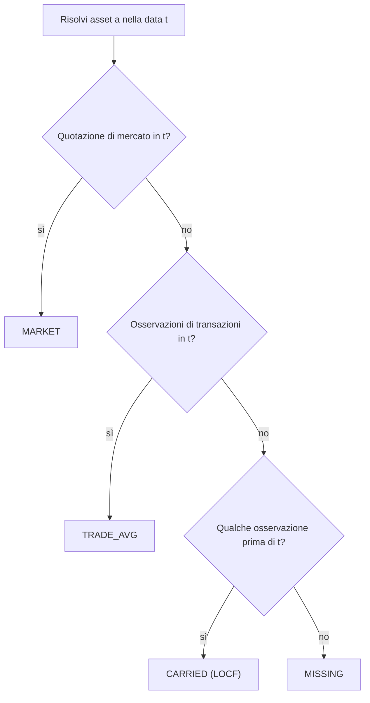

# 🧭 Risoluzione dei Prezzi

## 💡 Scopo

LibreFolio utilizza un unico risolutore unificato come fonte primaria di valutazione per posizioni aperte, NAV, valutazione dei lotti, linee di prezzo nei grafici e flag di qualità dei dati. Il risolutore risponde a una domanda quotidiana:

$$
\operatorname{mark}(a,t)=\text{miglior prezzo noto in valuta nativa per l'asset }a\text{ nella data }t
$$

È implementato da `AssetPriceSeries.resolve(t)` ed è costruito a partire da due classi di osservazioni:

- `MARKET`: `PriceHistory.close` del sistema-asset
- `TRADE`: prezzi impliciti dalle transazioni derivanti da righe di BUY/SELL e ADJUSTMENT prezzate

## 🧮 Cascata Gerarchica Giornaliera

Per ogni asset e data, le osservazioni vengono condensate in un unico prezzo giornaliero:

$$
\operatorname{mark}(a,t)=
\begin{cases}
\text{MARKET}(a,t), & \text{esiste una quotazione di mercato nello stesso giorno}\\
\operatorname{media}\bigl(\text{TRADE}(a,t)\bigr), & \text{esistono osservazioni di transazioni nello stesso giorno}\\
\text{ultima osservazione prima di }t, & \text{altrimenti, se esiste}\\
\varnothing, & \text{altrimenti}
\end{cases}
$$

Lo schema pubblico del motore associa i prezzi del risolutore alle etichette delle fonti di valutazione:

| Fonte del risolutore | Origine | Fonte di valutazione del portafoglio |
|-----------------|--------|----------------------------|
| `MARKET` | Quotazione reale dello stesso giorno | `MARKET_PRICE` |
| `TRADE_AVG` | Prezzo di transazione dello stesso giorno | `LAST_TRADE_PRICE` |
| `CARRIED` da MARKET | Quotazione reale obsoleta | `MARKET_PRICE` |
| `CARRIED` da TRADE | Prezzo di transazione obsoleto | `LAST_TRADE_PRICE` |
| `MISSING` | Nessuna osservazione nella data o prima | `MISSING` |

!!! warning "Nessuna cascata legacy"

    Il codice attualmente distribuito **non** utilizza un percorso di valutazione separato `market → last BUY → seed cost`. I prezzi di origine delle transazioni sono osservazioni all'interno del risolutore unificato; il PMC rimane la base di costo, non il prezzo di valutazione.

## 🌍 Valuta e Scala

I prezzi del risolutore rimangono nella loro **valuta nativa**. I consumatori convertono il prezzo alla **data di valutazione**:

$$
\mathrm{Prezzo}_{C^*}(a,t)=\operatorname{mark}(a,t)\cdot \mathrm{fx}\bigl(\mathrm{ccy}_{mark}, C^*, t\bigr)
$$

Questo è importante per i prezzi riportati (carried): una quotazione o transazione osservata in $s<t$ viene convertita utilizzando il tasso di cambio a $t$, non il tasso di cambio a $s$.

La base di costo utilizza tempistiche diverse. Il costo di acquisizione è ancorato alla data della transazione:

$$
\mathrm{Costo}_{C^*}(\tau)=\mathrm{Costo}_{nativo}(\tau)\cdot \mathrm{fx}\bigl(\mathrm{ccy}_{costo}, C^*, \tau\bigr)
$$

Tutte le osservazioni del risolutore risiedono sull'asse della quotazione di mercato, inclusa `quote_base_quantity`:

$$
\mathrm{Valore\_Posizione}(q,p,qbq)=\frac{q}{qbq}\cdot p
$$

I prezzi unitari di BUY/SELL e le rettifiche ADJUSTMENT prezzate vengono moltiplicati per `quote_base_quantity` prima di entrare nel risolutore, in modo che gli asset obbligazionari quotati per 100 unità nominali siano confrontabili sullo stesso asse di `PriceHistory.close`.

## 🏷️ Stimato e Obsoleto

`estimated=True` significa che il valore risolto è di origine TRADE:

$$
\mathrm{stimato}(a,t) \iff \mathrm{origine}(\operatorname{mark}(a,t))=\text{TRADE}
$$

Una quotazione di mercato reale riportata (carried) è obsoleta ma **non** stimata. L'obsolescenza è rappresentata separatamente tramite `BackwardFillInfo`:

$$
\mathrm{giorni\_indietro}=t-\mathrm{data\_di\_riferimento}
$$

`price_backward_fill.actual_rate_date` memorizza la data di osservazione e `days_back` memorizza l'età del LOCF. Gli avvisi di qualità dei dati del portafoglio valutano lo stato alla data di valutazione, non un'unione storica di tutti i giorni passati con dati riportati/stimati.

## ⚠️ Prezzi Mancanti

`MISSING` significa che non esiste alcuna osservazione di mercato o transazione nella data di valutazione o prima di essa. Nel motore del portafoglio, quella posizione non può contribuire al valore di mercato finché non esiste un prezzo. Nell'analisi dei lotti, la modalità "stimato al costo" può comunque valutare i lotti aperti al costo quando l'asset non ha alcuna serie di prezzi di mercato; vedere [Analisi Lotti FIFO](../fifo-engine/fifo-lot-analysis.md#estimated-at-cost).

Gli avvisi del portafoglio vengono valutati **alla data di valutazione**. Le valutazioni di origine transazione più vecchie del periodo di grazia di 14 giorni alimentano l'avviso "asset valutati al costo / nessun prezzo di mercato per più di due settimane"; un asset che successivamente riceve una quotazione di mercato reale cancella l'avviso.

## 🔗 Correlati

- 💼 [NAV](nav.md) — utilizza i prezzi del risolutore per il valore di mercato
- 📖 [Valore Contabile](book-value.md) — lato della base di costo, indipendente dai prezzi
- 📈 [Rendimento Netto Annualizzato](net-annualized-return.md) — annualizza i rendimenti basati sulle valutazioni del risolutore
- ⚙️ [Portfolio Engine](index.md) — modello completo
