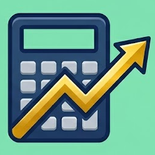

# 🔌 Providers

A provider keeps an asset's prices up to date for you: today's price, its history and, for some,
details such as the type or the sector. Each asset has at most one provider: pick a
**Search Online** result to connect it, or set it up yourself in **Provider Assignment** — see
[Create & Edit](../create-edit.md).

    <a href="yahoo-finance/" class="card-link" style="flex-direction: column; align-items: stretch; gap: 0.5rem;">
        

            
            Yahoo Finance
        

        Stocks, ETFs, funds and crypto from exchanges worldwide.
    </a>
    <a href="justetf/" class="card-link" style="flex-direction: column; align-items: stretch; gap: 0.5rem;">
        

            
            justETF
        

        European ETFs comparison, prices, and asset structures.
    </a>
    <a href="borsa-italiana/" class="card-link" style="flex-direction: column; align-items: stretch; gap: 0.5rem;">
        

            
            Borsa Italiana
        

        Italian stocks, bonds, ETFs and funds, in Italian or English.
    </a>
    <a href="css-scraper/" class="card-link" style="flex-direction: column; align-items: stretch; gap: 0.5rem;">
        

            
            CSS Scraper
        

        Web page selector scraper for custom bond prices or exotics.
    </a>
    <a href="scheduled-investment/" class="card-link" style="flex-direction: column; align-items: stretch; gap: 0.5rem;">
        

            
            Scheduled Investment
        

        Fixed-income assets calculating value via interest rate schedules.
    </a>
    <a href="../../../community/contribute/" class="card-link" style="flex-direction: column; align-items: stretch; gap: 0.5rem;">
     

     <svg xmlns="http://www.w3.org/2000/svg" viewBox="0 0 24 24" width="24" height="24" fill="none" stroke="currentColor" stroke-width="2" stroke-linecap="round" stroke-linejoin="round" style="color: var(--md-accent-fg-color);"><path d="M15.39 4.39a1 1 0 0 0 1.68-.474 2.5 2.5 0 1 1 3.014 3.015 1 1 0 0 0-.474 1.68l1.683 1.682a2.414 2.414 0 0 1 0 3.414L19.61 15.39a1 1 0 0 1-1.68-.474 2.5 2.5 0 1 0-3.014 3.015 1 1 0 0 1 .474 1.68l-1.683 1.682a2.414 2.414 0 0 1-3.414 0L8.61 19.61a1 1 0 0 0-1.68.474 2.5 2.5 0 1 1-3.014-3.015 1 1 0 0 0 .474-1.68l-1.683-1.682a2.414 2.414 0 0 1 0-3.414L4.39 8.61a1 1 0 0 1 1.68.474 2.5 2.5 0 1 0 3.014-3.015 1 1 0 0 1-.474-1.68l1.683-1.682a2.414 2.414 0 0 1 3.414 0z"/></svg>
     Request New Plugin
     

     Your price provider is missing? Request a new plugin or contribute code!
    </a>
    

## 📊 Provider Comparison

| Provider | Current price | History | Search | Details | Identifier | Best for |
|----------|:---:|:---:|:---:|:---:|---|---|
|  **Yahoo Finance** | ✅ | ✅ | ✅ | ✅ | Ticker (`AAPL`, `VWCE.DE`) or ISIN | Stocks, ETFs, funds and crypto worldwide |
|  **justETF** | ✅ | ✅ | ✅ | ✅ | ISIN (`IE00B4L5Y983`) | European ETFs, priced in EUR, USD, CHF or GBP |
|  **Borsa Italiana** | ✅ | ✅ | ✅ | ✅ | ISIN (`IT0003128367`) | Instruments listed in Milan, Italian mutual funds |
|  **CSS Scraper** | ✅ | ❌ | ❌ | ❌ | Page URL | A price shown on any public web page |
|  **Scheduled Investment** | ✅ | ✅ | ❌ | ❌ | None — created for you | Deposits, loans and bonds valued by their interest |

**Details** are the type, currency, description and similar data that LibreFolio offers to fill
in for you. Some providers also record [asset events](../detail/events.md): dividends (Yahoo
Finance, justETF), splits (Yahoo Finance), interest payouts and maturity (Scheduled Investment).

## 🎯 Choosing a Provider

- **Stocks, ETFs or crypto on any exchange** → **Yahoo Finance**.
- **A European ETF**, or ETF prices in USD, CHF or GBP → **justETF**.
- **Stocks, bonds, ETFs or funds traded in Milan**, and Italian mutual funds → **Borsa Italiana**.
- **A price that only a web page shows** → **CSS Scraper**.
- **A savings account, term deposit, P2P loan or bond followed by its interest** →
  **Scheduled Investment**.
- **Nothing fits?** Tick **No Provider** and enter the prices yourself in the
  [Data Editor](../detail/data-editor.md).

## 🔗 Related

- 🛠️ **For developers: [Asset Providers](../../../developer/backend/assets/system_providers.md)** — How each provider works inside
