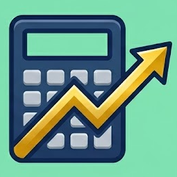

# 🔌 Fournisseurs de Prix

LibreFolio prend en charge plusieurs fournisseurs de prix pour récupérer automatiquement les prix actuels et les données historiques de vos actifs.

    <a href="yahoo-finance/" class="card-link" style="flex-direction: column; align-items: stretch; gap: 0.5rem;">
        

            
            Yahoo Finance
        

        Fournisseur par défaut pour actions mondiales, ETF et fonds communs.
    </a>
    <a href="justetf/" class="card-link" style="flex-direction: column; align-items: stretch; gap: 0.5rem;">
        

            
            justETF
        

        Comparaison des ETF européens, prix et structures d'actifs.
    </a>
    <a href="borsa-italiana/" class="card-link" style="flex-direction: column; align-items: stretch; gap: 0.5rem;">
        

            
            Borsa Italiana
        

        Actions italiennes, obligations, ETF et fonds avec recherche URL intelligente.
    </a>
    <a href="css-scraper/" class="card-link" style="flex-direction: column; align-items: stretch; gap: 0.5rem;">
        

            
            CSS Scraper
        

        Scraper de pages web pour prix d'obligations personnalisées ou exotiques.
    </a>
    <a href="scheduled-investment/" class="card-link" style="flex-direction: column; align-items: stretch; gap: 0.5rem;">
        

            
            Investissement Programmé
        

        Actifs à revenu fixe calculant leur valeur via des calendriers de taux d'intérêt.
    </a>
    <a href="../../../community/contribute/" class="card-link" style="flex-direction: column; align-items: stretch; gap: 0.5rem;">
     

     <svg xmlns="http://www.w3.org/2000/svg" viewBox="0 0 24 24" width="24" height="24" fill="none" stroke="currentColor" stroke-width="2" stroke-linecap="round" stroke-linejoin="round" style="color: var(--md-accent-fg-color);"><path d="M15.39 4.39a1 1 0 0 0 1.68-.474 2.5 2.5 0 1 1 3.014 3.015 1 1 0 0 0-.474 1.68l1.683 1.682a2.414 2.414 0 0 1 0 3.414L19.61 15.39a1 1 0 0 1-1.68-.474 2.5 2.5 0 1 0-3.014 3.015 1 1 0 0 1 .474 1.68l-1.683 1.682a2.414 2.414 0 0 1-3.414 0L8.61 19.61a1 1 0 0 0-1.68.474 2.5 2.5 0 1 1-3.014-3.015 1 1 0 0 0 .474-1.68l-1.683-1.682a2.414 2.414 0 0 1 0-3.414L4.39 8.61a1 1 0 0 1 1.68.474 2.5 2.5 0 1 0 3.014-3.015 1 1 0 0 1-.474-1.68l1.683-1.682a2.414 2.414 0 0 1 3.414 0z"/></svg>
     Demander un Nouveau Plugin
     

     Votre fournisseur de prix est manquant ? Demandez un nouveau plugin ou contribuez !
    </a>

## 📊 Comparaison des Fournisseurs

| Fournisseur | Prix Actuel | Historique | Recherche | Identifiant | Remarques |
|----------|:---:|:---:|:---:|---|---|
|  **Yahoo Finance** | ✅ | ✅ | ✅ | Ticker (ex. `AAPL`, `VWCE.DE`) | Meilleur pour actions, ETF, fonds communs |
|  **justETF** | ✅ (EUR) | ✅ | ✅ | ISIN (ex. `IE00BK5BQT80`) | ETF européens, multi-devises |
|  **Borsa Italiana** | ✅ | ✅ | ✅ | ISIN ; les fonds utilisent un code interne | Actions italiennes, obligations, ETF et fonds. NAV des fonds valeur courante uniquement si datée d'aujourd'hui. |
|  **CSS Scraper** | ✅ | ❌ | ❌ | URL | Extrait les données de prix de n'importe quelle page web |
|  **Investissement Programmé** | ✅ | ✅ | ❌ | Auto-généré | Instruments à revenu fixe avec calendriers d'intérêts |

## 🎯 Choisir un Fournisseur

- **Actions & ETF** : Utilisez **Yahoo Finance** — couverture la plus large, supporte la recherche
- **ETF Européens** : Utilisez **justETF** pour des données plus détaillées sur les ETF européens
- **Borsa Italiana** : Utilisez Borsa Italiana directement pour les actions, obligations, ETF et fonds Euronext Milano. La recherche intelligente peut également résoudre les URL Borsa et capturer automatiquement les paramètres.
- **Comptes d'épargne / Dépôts à terme** : Utilisez **Investissement Programmé** avec des calendriers d'intérêts
