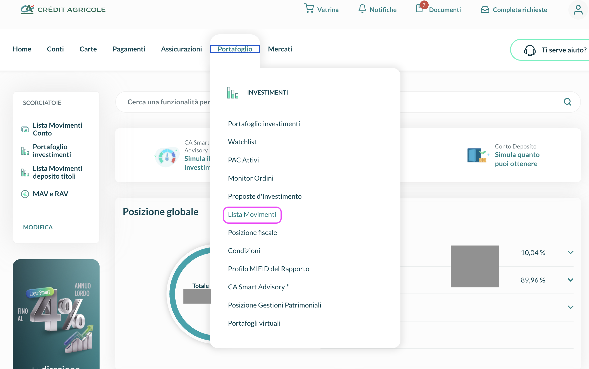
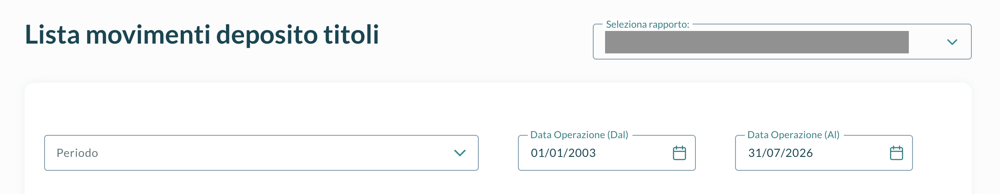
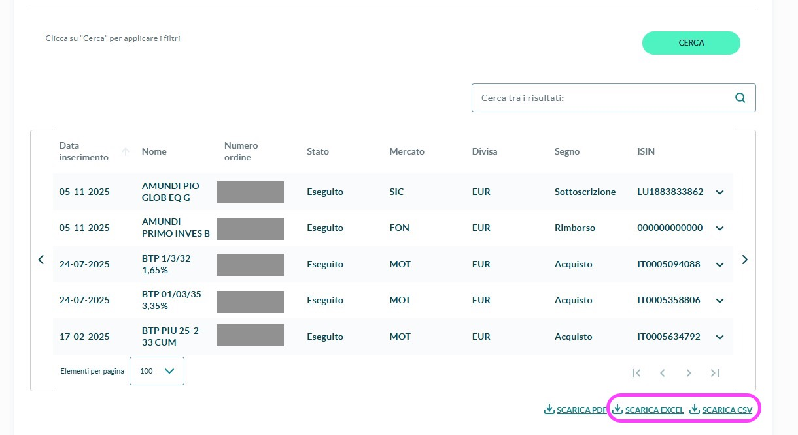
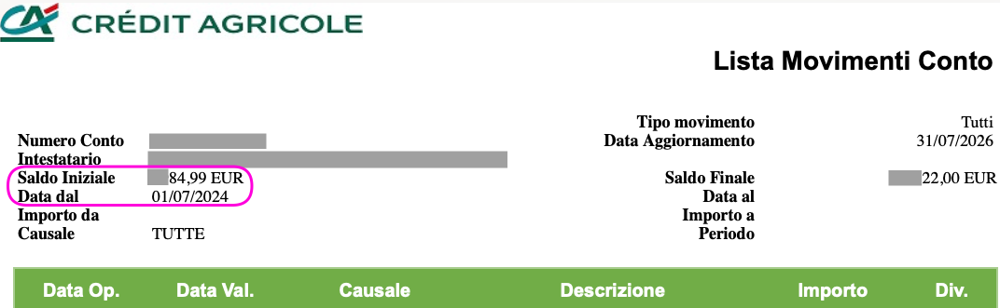
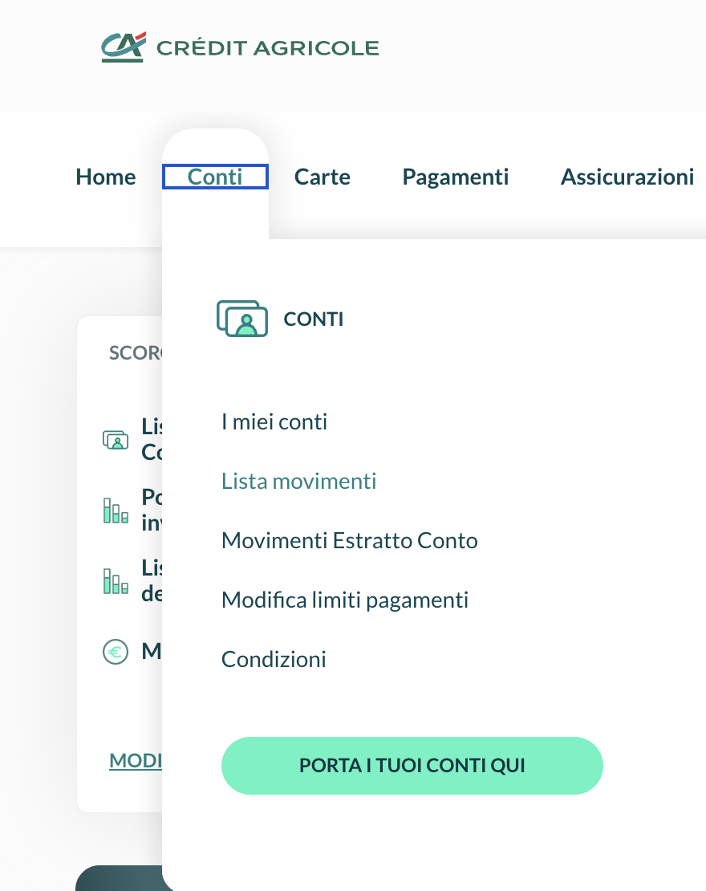
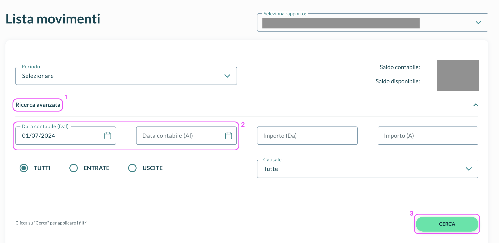
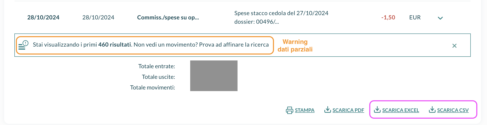

# 📥  Crédit Agricole

Crédit Agricole è **banca e broker** insieme: sullo stesso conto tieni sia la tua **liquidità** (stipendio o pensione, bonifici, utenze, tasse) sia i tuoi **titoli**. Per questo l'import da fare è la **Lista Movimenti Conto**: è l'estratto conto completo e porta in LibreFolio la **liquidità reale** — bonifici, utenze, pensione, **tasse**, **commissioni** e le **cedole e dividendi** effettivamente accreditati. Scarichi il file, lo importi così com'è e il plugin riconosce il tracciato da solo.

L'estratto conto copre gli **ultimi 2 anni**. Se il tuo conto titoli è **più vecchio** e vuoi recuperarne lo **storico**, apri il pannello qui sotto **prima** di procedere.

??? note "📦 Conto titoli più vecchio di 2 anni? Recupera lo storico (opzionale)"

    L'estratto conto si ferma a **2 anni**. Se il dossier titoli è più vecchio, aggiungi un secondo export — la **Lista Movimenti Deposito Titoli** — che va indietro molto più in là e recupera almeno lo **storico dei titoli** (quantità, prezzi, cedole, scadenze) **antecedente** a quella finestra. È **solo titoli**: **non** porta la liquidità del conto corrente (bonifici, utenze, tasse…), che resta quella della Lista Movimenti Conto. La cassa di questo export viene **auto-bilanciata** per non falsare i saldi.

    **Come combinarli senza doppioni.** Esporta prima la **Lista Movimenti Conto** e annota la sua data di inizio (**"Data dal"**). Poi esporta la **Lista Movimenti Deposito Titoli** **troncata** così che finisca il giorno **prima** dell'inizio dei movimenti conto: i due file **non si sovrappongono** e la stessa operazione non viene contata due volte.

    #### 📂 Passo 1 — Apri il dossier titoli

    Dall'internet banking, apri la sezione del **Deposito Titoli** e vai alla lista movimenti.

    { style="max-height: 460px; width: auto; border-radius: 8px; box-shadow: 0 4px 16px rgba(0,0,0,0.15);" }

    #### 🗓️ Passo 2 — Seleziona il periodo

    Vai il più indietro possibile, poi tronca all'inizio dei movimenti conto (vedi il suggerimento sopra).

    { style="max-height: 460px; width: auto; border-radius: 8px; box-shadow: 0 4px 16px rgba(0,0,0,0.15);" }

    #### 💾 Passo 3 — Esporta

    Esporta e importa il file in LibreFolio senza aprirlo o modificarlo.

    { style="max-height: 460px; width: auto; border-radius: 8px; box-shadow: 0 4px 16px rgba(0,0,0,0.15);" }

    #### 💰 Passo 4 — Saldo iniziale (deposito manuale)

    Serve per avere i **totali di liquidità corretti**: nessuno dei due export riporta la giacenza di partenza come movimento, quindi senza questo passo la cassa assoluta parte da zero all'inizio della finestra esportata e resta sfalsata.

    **Come si ottiene.** Il **Saldo Iniziale** si legge in due punti equivalenti (è lo stesso valore): in cima al **file Excel** della *Lista Movimenti Conto* e anche **all'inizio dell'export sulla pagina web** — la stessa pagina da cui esporti i movimenti conto. È il valore (es. `2984,99 EUR`) alla data **"Data dal"** (es. `01/07/2024`).

    Il plugin **non** lo crea da solo: al momento dell'import **crea a mano una transazione di deposito di liquidità** pari a quel **Saldo Iniziale**, con **data** uguale alla **"Data dal"**. Così la cassa assoluta resta corretta anche se l'export copre solo una finestra.

    { style="max-height: 460px; width: auto; border-radius: 8px; box-shadow: 0 4px 16px rgba(0,0,0,0.15);" }

    **Come vengono mappate le operazioni titoli.** Il report riporta solo il **nome** del titolo (`Nome`), non l'ISIN: gli asset sono abbinati per nome — conferma l'asset nello **Step 4** del wizard se non è riconosciuto.

    | Causale | Importata come |
    |:--------|:---------------|
    | `CEDOLA` | **Cedola** obbligazionaria → interesse (il nominale nella colonna quantità è ignorato) |
    | `ACQ.CONT.SU MERC.`, `SICAV: SOTTOSCR` | **Acquisto** con **deposito** automatico di pari importo |
    | `FONDI: RIMBORSO` | **Vendita** (rimborso fondo) con **prelievo** automatico di pari importo |
    | `TITOLI SCADUTI` | **Scadenza** obbligazionaria: **vendita alla pari (100)** + una gamba **interesse** per l'eventuale importo sopra la pari |
    | `GIRO ALTRO DOSSIER`, `VERS.TITOLI` | **Trasferimento in ingresso** da successione → **rettifica** senza cassa con prezzo di carico per unità |

    Gli importi sono importati **alla lettera** nella valuta riportata: nessuna conversione, la colonna *Cambio* è ignorata. La data usata è *Data operazione*.

    **Modello di cassa (titoli).** Essendo un export solo titoli, LibreFolio mantiene il saldo cassa **neutro** con contropartite automatiche (tag `auto_cash`): ogni **acquisto** riceve un **deposito** di pari importo, ogni **vendita**/**cedola**/**interesse di scadenza** riceve un **prelievo** di pari importo. Così l'export titoli **non accumula liquidità fantasma** — la cassa vera arriva dalla Lista Movimenti Conto.

## 💳 Come importare — Lista Movimenti Conto

È l'import **principale**: l'estratto conto con la **liquidità reale** (bonifici, utenze, pensione, tasse, commissioni, cedole e dividendi accreditati). Copre gli **ultimi 2 anni**.

### 📄 Passo 1 — Apri i movimenti del conto

Dall'internet banking, apri la sezione del **conto corrente** e vai alla lista movimenti.

{ style="max-height: 460px; width: auto; border-radius: 8px; box-shadow: 0 4px 16px rgba(0,0,0,0.15);" }

### 🗓️ Passo 2 — Seleziona il periodo

Clicca su **Ricerca avanzata** per aprire i filtri per data, poi imposta la finestra più ampia consentita (l'export conto è limitato a **2 anni**).

{ style="max-height: 460px; width: auto; border-radius: 8px; box-shadow: 0 4px 16px rgba(0,0,0,0.15);" }

### 💾 Passo 3 — Esporta

Scarica la lista e importala in LibreFolio senza modificarla.

{ style="max-height: 460px; width: auto; border-radius: 8px; box-shadow: 0 4px 16px rgba(0,0,0,0.15);" }

!!! warning "Se compare l'avviso sul periodo massimo"

    Crédit Agricole limita quante righe/mesi puoi esportare in una volta. Se appare l'avviso, **spezza l'export in più sotto-blocchi** finché copri tutti i mesi mancanti:

    1. Esporta il blocco così com'è mostrato.
    2. Guarda l'**ultima (più vecchia)** transazione del blocco appena scaricato e annotane la data.
    3. Torna al selettore periodo e imposta come **data di fine ("al")** la data di quell'ultima transazione.
    4. Esporta il nuovo blocco e **ripeti** dal punto 2 finché arrivi al periodo desiderato.
    5. Importa in LibreFolio **tutti** i file esportati.

### 📝 Come vengono mappate le operazioni conto

Le **causali** del conto sono classificate così:

| Tipo di causale | Importata come |
|:----------------|:---------------|
| Cedole / dividendi accreditati | **Interesse** (cedola) o **Dividendo** se la descrizione identifica un titolo con **ISIN**; altrimenti **interesse** |
| Interessi/competenze a credito | **Interesse** (importo positivo) |
| Canone, commissioni, spese di gestione, spese stacco cedola | **Commissione** (cassa in uscita) |
| Capital gain, imposta di bollo, ritenuta, D.Lgs 461 | **Tassa** (cassa in uscita) |
| Compravendita titoli/fondi | **Acquisto/Vendita** quando descrizione e segno concordano e la quantità è ricavabile; altrimenti **deposito/prelievo** con **segnalazione bloccante** da completare nello step di correzione |
| Titoli scaduti o estratti | **Vendita alla pari** che chiude la posizione |
| Bonifico in entrata che rimborsa un fondo | **Deposito** + **segnalazione bloccante**: il fondo dichiara il controvalore, non le quote, quindi scegli tu il fondo e inserisci la quantità |
| Pensione/emolumenti, POS, utenze, prelievi, altri giroconti | **Deposito** (importo > 0) / **Prelievo** (importo < 0) per segno |

## 🔗 Riferimento per sviluppatori

→ [BRIM Providers — Dettagli di implementazione](../../../developer/backend/brim/providers_list.md)
