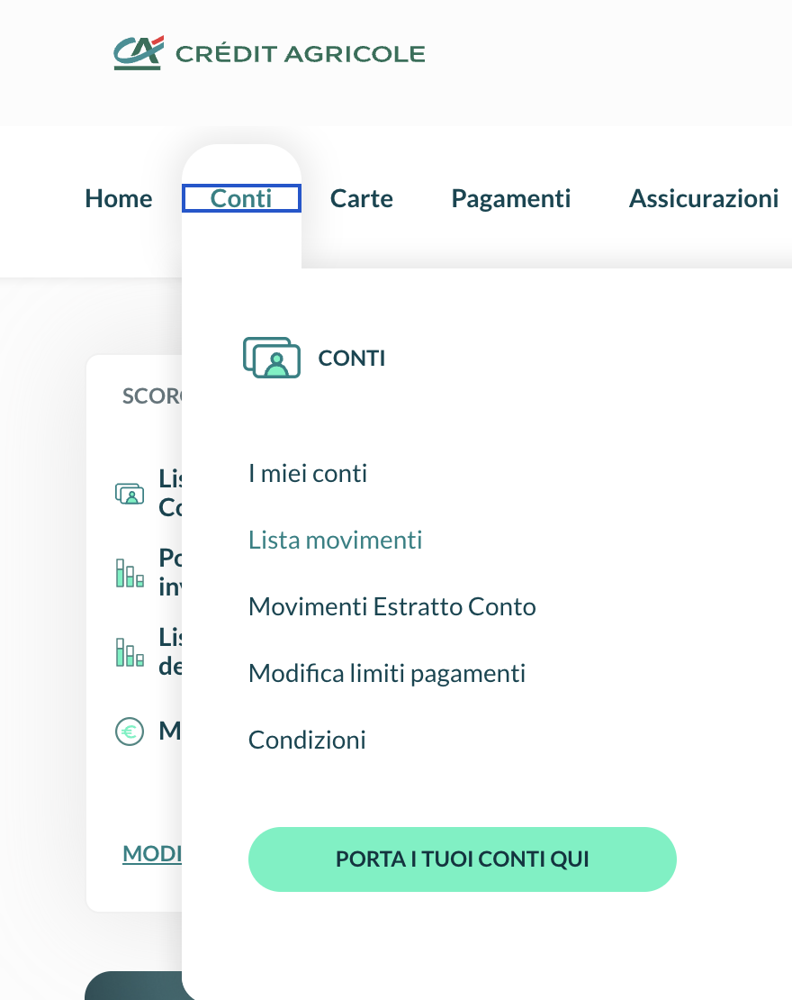
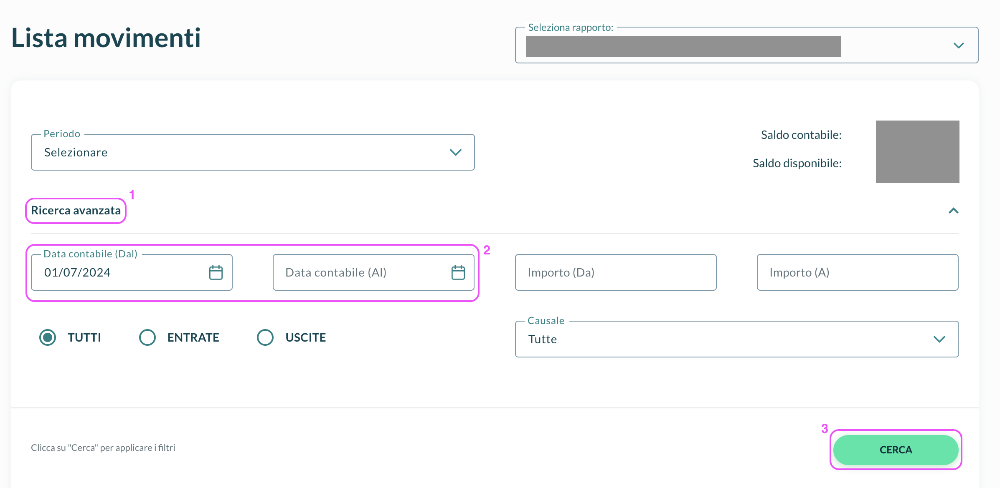
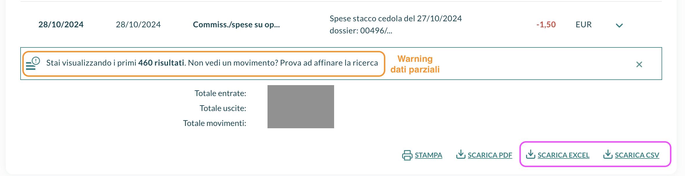
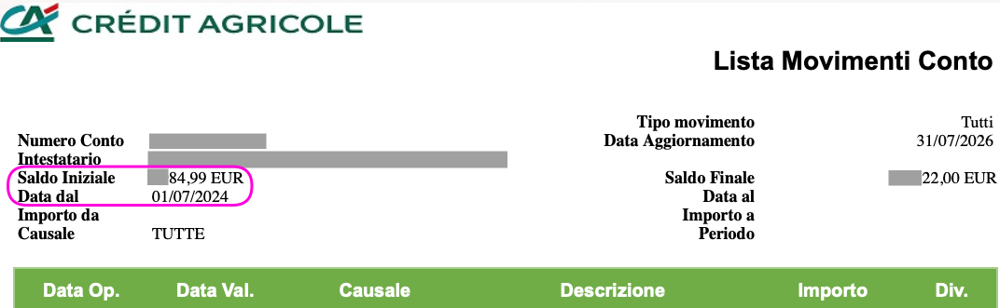
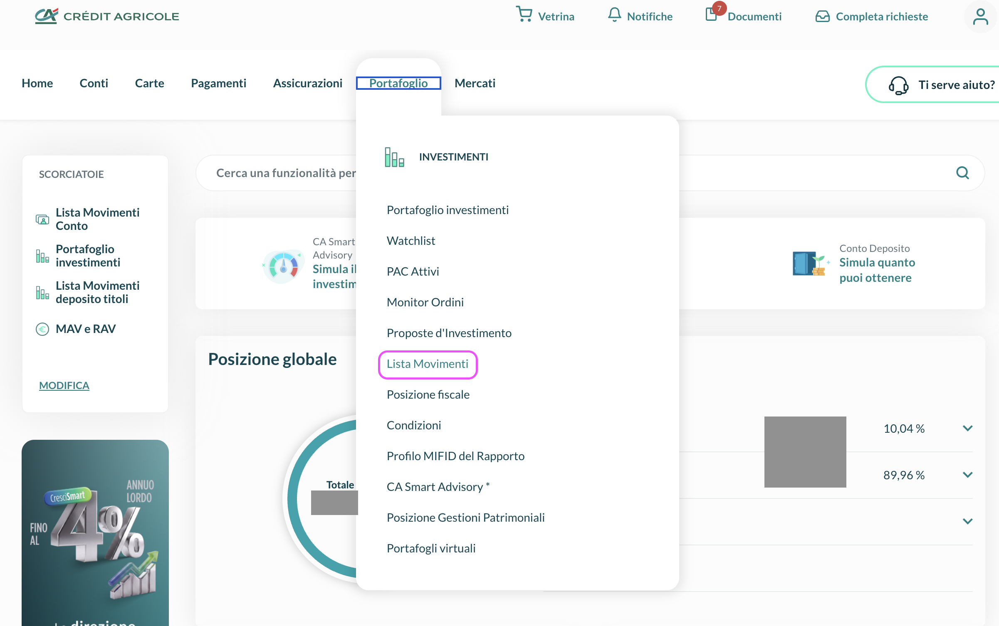
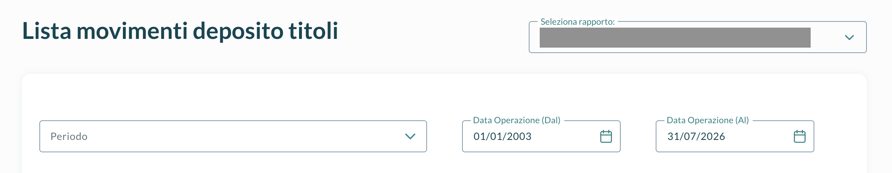
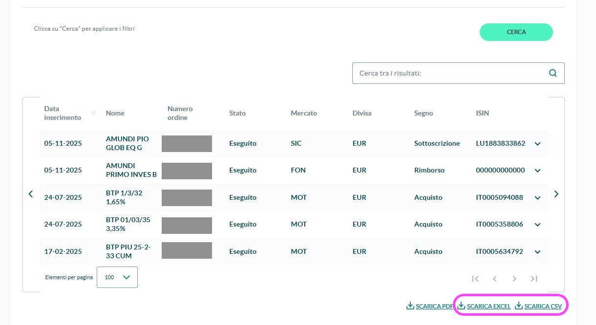

# 📥  Crédit Agricole

Crédit Agricole è sia la tua **banca che il tuo broker**. L'importazione principale è la **Lista movimenti** del conto: gli ultimi **due anni** di liquidità reale — stipendio o pensione, bonifici, bollette, imposte, commissioni, cedole e dividendi.

## 💳 Esporta i movimenti del conto

### 📄 Passaggio 1 — Apri la lista movimenti

Nell'home banking, apri **Conti** nel menu in alto e scegli **Lista movimenti**. Se hai più conti, seleziona il tuo in **Seleziona rapporto**.

{ style="max-height: 460px; width: auto; border-radius: 8px; box-shadow: 0 4px 16px rgba(0,0,0,0.15);" }

### 🗓️ Passaggio 2 — Scegli il periodo

Clicca su **Ricerca avanzata**, imposta **Data contabile (Dal)** e **Data contabile (Al)** sulla finestra più ampia consentita dalla banca (due anni), poi clicca su **CERCA**.

{ style="max-height: 460px; width: auto; border-radius: 8px; box-shadow: 0 4px 16px rgba(0,0,0,0.15);" }

### 💾 Passaggio 3 — Scarica il file

Sotto la lista, clicca su **SCARICA EXCEL** o **SCARICA CSV**, e importa il file senza aprirlo o modificarlo.

{ style="max-height: 460px; width: auto; border-radius: 8px; box-shadow: 0 4px 16px rgba(0,0,0,0.15);" }

??? warning "✂️ Esportazione a blocchi — quando la banca mostra solo i primi risultati"

    Quando la lista dice **Stai visualizzando i primi … risultati**, è stata tagliata e i movimenti più vecchi mancano. Esporta il periodo a blocchi:

    1. Scarica il blocco così com'è.
    2. Annota la data del suo movimento **più vecchio**.
    3. Imposta **Data contabile (Al)** su quella data, clicca su **CERCA** e scarica di nuovo.
    4. Ripeti finché un blocco raggiunge l'inizio del tuo periodo.

    Importa tutti i blocchi insieme. Il giorno in cui due blocchi si incontrano è presente in entrambi i file: il passaggio **Duplicati** della procedura guidata ne conserva una copia ([come funziona](how-to.md#only-when-needed)).

### 💰 Passaggio 4 — Aggiungi il saldo iniziale

L'esportazione elenca i movimenti, non la liquidità che già possedevi, quindi la liquidità del broker partirebbe da zero. Leggi **Saldo Iniziale** e **Data dal** in cima all'esportazione Excel, e aggiungi un **Deposito** di quell'importo in quella data con il [modulo transazione](../form.md).

{ style="max-height: 460px; width: auto; border-radius: 8px; box-shadow: 0 4px 16px rgba(0,0,0,0.15);" }

## 🕰️ Storico titoli più vecchio di due anni

Il tuo conto titoli ha più di due anni? Una seconda esportazione, la **Lista movimenti deposito titoli**, recupera le operazioni precedenti, le cedole e le scadenze — solo titoli, senza liquidità bancaria.

??? note "📦 Aggiungi lo storico titoli — quando il tuo conto titoli ha più di due anni"

    Esportala **dopo** i movimenti del conto, e falla terminare il giorno **prima** della loro **Data dal**: i due file così non si sovrappongono mai, e nessuna operazione viene contata due volte.

    #### 📂 Passaggio 1 — Apri i movimenti titoli

    Apri **Portafoglio** nel menu in alto e scegli **Lista Movimenti**.

    { style="max-height: 460px; width: auto; border-radius: 8px; box-shadow: 0 4px 16px rgba(0,0,0,0.15);" }

    #### 🗓️ Passaggio 2 — Scegli il periodo

    Imposta **Data Operazione (Dal)** il più indietro possibile consentito dalla banca, e **Data Operazione (Al)** al giorno prima della **Data dal** dei movimenti del conto.

    { style="max-height: 460px; width: auto; border-radius: 8px; box-shadow: 0 4px 16px rgba(0,0,0,0.15);" }

    #### 💾 Passaggio 3 — Scarica il file

    Clicca su **CERCA**, poi su **SCARICA EXCEL** o **SCARICA CSV**, e importa il file così com'è.

    { style="max-height: 460px; width: auto; border-radius: 8px; box-shadow: 0 4px 16px rgba(0,0,0,0.15);" }

    #### 🔄 Cosa importa questo file

    | Nel file (**Causale**) | Importato come |
    |:--------------------------|:------------|
    | `CEDOLA` | **Interesse** (cedola obbligazionaria) |
    | `ACQ.CONT.SU MERC.`, `SICAV: SOTTOSCR` | **Acquisto** |
    | `FONDI: RIMBORSO` | **Vendita** (rimborso fondo) |
    | `TITOLI SCADUTI` | **Vendita** alla pari (100), più **Interesse** per qualsiasi importo pagato sopra la pari |
    | `GIRO ALTRO DOSSIER`, `VERS.TITOLI` | **Rettifica**: titoli trasferiti da un altro dossier, come un'eredità, al loro valore contabile e senza liquidità |

    Qualsiasi altra causale viene saltata con un avviso. Ogni acquisto riceve un **Deposito** corrispondente, e ogni vendita, cedola o premio un **Prelievo** corrispondente: questo file non aggiunge liquidità propria, e la liquidità reale proviene dai movimenti del conto.

## 🔄 Cosa viene importato

| Nei movimenti del conto | Importato come |
|:-------------------------|:------------|
| Stipendio o pensione, pagamenti con carta, bollette, prelievi di contante, bonifici | **Deposito** o **Prelievo**, in base al segno dell'importo |
| Cedole e dividendi | **Interesse** o **Dividendo**, collegato al titolo quando la riga fornisce il suo ISIN; una ritenuta dichiarata (`RITENUTA`) diventa un'**Imposta** separata |
| Interessi sul conto e canone mensile (`INTERESSI/COMPETENZE`) | **Interesse** quando accreditato, **Commissione** quando addebitata |
| Commissioni e oneri | **Commissione**, oppure **Imposta** per l'imposta sulle plusvalenze, imposta di bollo e ritenute |
| Acquisti e vendite di titoli e fondi | **Acquisto** o **Vendita** quando le cedole della stessa obbligazione forniscono la quantità; altrimenti una riga di liquidità da completare |
| Obbligazioni scadute o estratte | **Vendita** alla pari (100), più **Interesse** per qualsiasi premio; senza il nominale dell'obbligazione nel file, una **Vendita** dell'intero importo, con un avviso |
| Un rimborso di fondo pagato tramite bonifico | Un **Deposito** da completare: la banca indica il denaro, non le quote vendute |
| Qualsiasi altra operazione | **Deposito** o **Prelievo** in base al segno, elencato in un avviso per consentirti di verificarlo |

## ⚠️ Da sapere

- **Alcune righe richiedono il tuo aiuto** nel passaggio **Correzioni** della procedura guidata ([come funziona](how-to.md#only-when-needed)):
    - operazioni senza quantità, e rimborsi di fondi: scegli il tipo, il titolo e la quantità;
    - operazioni il cui importo può includere interessi maturati e commissioni: aggiungili sotto **Separare il prezzo dagli oneri?**, dalla tua nota informativa;
    - oneri che non nominano alcun titolo: assegnateli, o tienili sul conto.
- **I titoli sono abbinati per nome.** L'esportazione dei titoli non fornisce l'ISIN: abbina ogni titolo nel pannello **Risolvi asset** di [Riepilogo](how-to.md#review).
- **Importi come scritti**, nella valuta di ciascuna riga, senza conversione. Le date sono le date dell'operazione.
- **Messaggi in italiano.** La maggior parte degli avvisi dell'importatore su questi file è in italiano, come il report.

## 🔗 Riferimento per sviluppatori

→ [Importatore Crédit Agricole — Dettagli di implementazione](../../../developer/backend/brim/credit_agricole.md)
