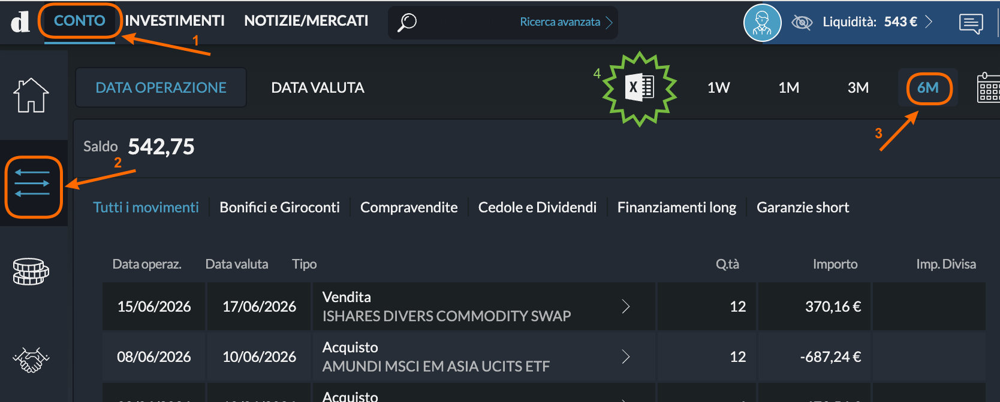
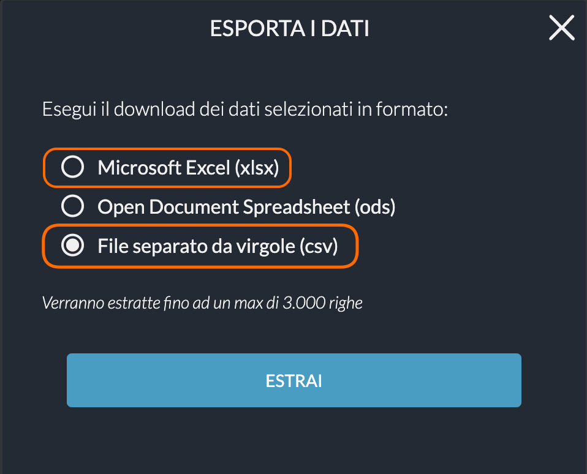

#  Directa SIM

!!! info "Beta"

    This plugin is in **Beta** — tested with sample files but edge cases may exist.

## 📥 How to Export

LibreFolio supports both the **CSV** and **XLSX** (Excel) formats exported from Directa SIM. The screenshots below are from desktop, but the steps are similar on mobile.

### Step 1 — Open the transaction list

Log in to [Directa](https://www.directatrading.com) and click the **CONTO** tab (❶). Then click the transactions filter icon on the left (❷) and select the time period you want — e.g. **6M** (❸).

{ style="border-radius: 8px; box-shadow: 0 4px 16px rgba(0,0,0,0.15);" }

### Step 2 — Export as CSV or Excel

Click the export icon (the spreadsheet icon with the green **X**) at the top of the table. In the dialog that opens, select **File separato da virgole (csv)** (or the Excel option) and click **ESTRAI**.

{ style="border-radius: 8px; box-shadow: 0 4px 16px rgba(0,0,0,0.15);" }

Save the file and import it into LibreFolio. If you choose CSV, don't open or re-save it in Excel first, as that can alter the number formatting.

## 📝 Notes

- Supports stock, bond, and ETF trades, dividends, taxes (*ritenute fiscali*), and transaction fees.
- Both **CSV** and **XLSX** (Excel) formats are supported — not ods.
- Account operations are denominated in EUR.
- The export covers up to 3,000 rows per file. For longer histories, export multiple periods and import them in sequence.

