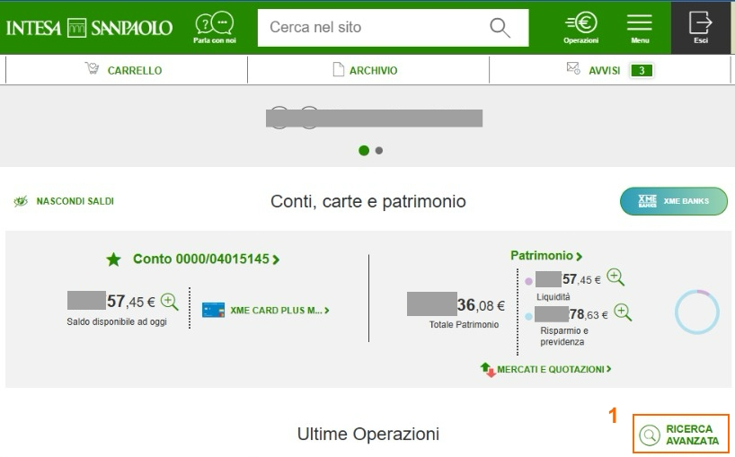
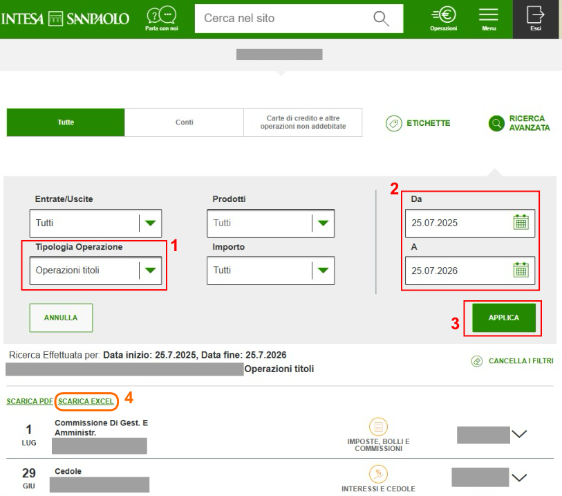

# 📥  Intesa Sanpaolo

!!! info "Beta"

    Questo plugin è in **Beta** — testato con file di esempio ma potrebbero esistere casi limite.

LibreFolio legge due esportazioni di Intesa Sanpaolo, in **CSV** o **Excel (XLSX)**, così come le scarichi:

- l'**elenco movimenti** — le cedole, i dividendi, le commissioni e le imposte di un periodo;
- l'**istantanea del portafoglio** (*patrimonio*) — le tue posizioni al loro costo fiscale, e il tuo saldo di cassa.

## 🧭 Quali file devo importare?

=== "Account appena creato"

    Importa l'**elenco movimenti**: fornisce le cedole, i dividendi, le commissioni e le imposte. LibreFolio
    non ne ricava acquisti o vendite, quindi aggiungi i tuoi acquisti manualmente con il
    [modulo transazione](../form.md), o con un file [CSV generico](generic-csv.md).

=== "Account con storico (consigliato)"

    Intesa esporta circa **un anno** di movimenti, e LibreFolio non ne ricava acquisti o vendite.
    Inizia invece dall'istantanea del portafoglio:

    1. Importa l'**istantanea del portafoglio**. Aggiunge un **Deposito** per il tuo saldo di cassa e una
       **Rettifica** per ogni posizione, al suo costo fiscale, tutte datate alla data dell'istantanea: la data
       di quotazione più recente nel report.
    2. Imposta la **Data apertura conto** del broker a quel giorno. I movimenti più vecchi sono già conteggiati
       nell'istantanea: la procedura guidata li contrassegna come **Prima dell'apertura** e li esclude
       ([come funziona](how-to.md#opening-date)).
    3. Da quel momento in poi, importa l'**elenco movimenti** per le nuove cedole, i dividendi, le commissioni e le imposte.

## 📥 Come esportare

### 🔍 Passaggio 1 — Apri la ricerca avanzata

Nella pagina iniziale della tua banca online, clicca su **RICERCA AVANZATA**, accanto a **Ultime Operazioni**.

{ style="max-height: 460px; width: auto; border-radius: 8px; box-shadow: 0 4px 16px rgba(0,0,0,0.15);" }

### 🗓️ Passaggio 2 — Filtra e scarica i movimenti

Imposta **Tipologia Operazione** su **Operazioni titoli**, scegli il periodo in **Da** e **A**, clicca su **APPLICA**, poi su **SCARICA EXCEL**.

{ style="max-height: 460px; width: auto; border-radius: 8px; box-shadow: 0 4px 16px rgba(0,0,0,0.15);" }

### 📊 Passaggio 3 — Scarica l'istantanea del portafoglio

Per un account con storico, apri **Patrimonio** dalla pagina iniziale e scarica le posizioni del
tuo *Deposito Amministrato*.

## 🔄 Cosa viene importato

| Nell'elenco movimenti (**Operazione**) | Importato come |
|:---------------------------------------|:------------|
| *Cedole* | **Interesse**, collegato al titolo indicato in **Dettagli** |
| *Dividendi…* | **Dividendo**, collegato allo stesso modo |
| *Commissioni…* | **Commissione** |
| *Ritenut…*, *Imposta…*, *Bollo…* | **Imposta** |

Qualsiasi altra operazione — acquisti, vendite e righe bancarie quotidiane come pagamenti con carta o bonifici
incluse — viene ignorata con un avviso: l'importazione non fallisce mai a causa di ciò.

Dall'**istantanea del portafoglio**: una **Rettifica** per ogni posizione (la sua quantità, al suo costo fiscale)
e un **Deposito** per il saldo di cassa quando non è zero, tutto alla data dell'istantanea.

## ⚠️ Da sapere

- **Filtra su Operazioni titoli.** Senza quel filtro, ogni pagamento con carta o bonifico del
  periodo compare negli avvisi come riga ignorata.
- **Lo stesso titolo, due nomi.** L'elenco movimenti indica un titolo solamente in testo libero, mentre
  l'istantanea fornisce il suo ISIN. Associa entrambi allo stesso asset nel pannello **Resolve Assets** di
  [Revisione](how-to.md#review).
- **Importi come scritti.** I movimenti mantengono la valuta della loro colonna **Valuta**, e l'istantanea
  è in euro: nulla viene convertito.
- **Messaggi in italiano.** Gli avvisi di importazione sono in italiano, come il report.

## 🔗 Riferimenti per sviluppatori

→ [Architettura BRIM — note su Intesa Sanpaolo](../../../developer/backend/brim/architecture.md#plugin-intesa)
