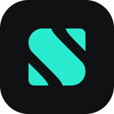
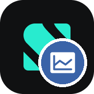
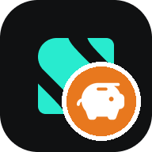

# 📥  Scalable Capital

!!! info "Alpha"

    These importers are in **Alpha**: some kinds of rows have not been seen yet in real exports (see [Limits](#limits)). If a file is refused, or a row is imported in a way that looks wrong, please tell us in the project's [issues](https://github.com/Librefolio/LibreFolio/issues).

LibreFolio imports both accounts of **Scalable Capital**: the **broker account** and the **overnight account** (*Tagesgeld*, *conto deposito*). LibreFolio is not affiliated with Scalable Capital.

---

## 🏦 Two accounts, two brokers {: #two-brokers }

Each account becomes a broker of its own in LibreFolio, read by its own importer:

| Scalable account | Importer | Files it reads |
|:--|:--|:--|
| Broker account | **Scalable Capital broker** | the LibreFolio exporter's broker file, or Scalable's own CSV |
| Overnight account | **Scalable Capital overnight account** | the LibreFolio exporter's overnight account file |

Why two brokers? Each account has its own cash balance and its own IBAN, and the money you move between them is a **Cash Transfer**, which links two brokers. With two brokers, each balance can be checked against Scalable's app, and each transfer becomes one linked pair. Each importer refuses the other account's file and names the importer that reads it.

---

## 📤 What to export

### 🧩 Recommended: the LibreFolio exporter {: #exporter }

The [LibreFolio exporter](https://github.com/Librefolio/librefolio-exporter) is an extension for Chrome, Edge, Brave and the other Chromium browsers, version 120 or later. It reads your transactions on Scalable's pages, in your browser, and saves them as CSV files:

- it works on **every plan**, FREE included;
- it is the **only way** to export the **overnight account**;
- it adds what Scalable's own CSV lacks: the **transaction id** and the **exact type** of each movement.

Before you install it, read the exporter's [README](https://github.com/Librefolio/librefolio-exporter#readme): it covers installing and updating in full, privacy, and the risks of an extension that uses the internal interface of Scalable's web app.

**Install it once:**

1. Download the two files of the [latest release](https://github.com/Librefolio/librefolio-exporter/releases/latest), `librefolio-exporter-<version>.zip` and `librefolio-exporter-<version>.zip.sha256`, into the same folder — for example `Downloads/chromePlugin`.
2. Check the ZIP from a terminal. The `cd` goes to that folder; the second command compares the ZIP with the fingerprint in its `.sha256` file:

    === "macOS"

        ```bash
        cd ~/Downloads/chromePlugin
        shasum -a 256 -c librefolio-exporter-*.zip.sha256
        ```

    === "Linux"

        ```bash
        cd ~/Downloads/chromePlugin
        sha256sum -c librefolio-exporter-*.zip.sha256
        ```

    === "Windows"

        Windows has no command that reads `.sha256` files: use the PowerShell lines of the exporter's [README](https://github.com/Librefolio/librefolio-exporter#readme).

    `OK` means the ZIP is exactly the one published. On any other answer, do not install it: download both files again.

3. Unzip it in that folder: you get a `librefolio-exporter` folder. Leave it there, since the browser loads the extension from it.
4. Open `chrome://extensions` (`edge://extensions` in Edge), turn on **Developer mode**, click **Load unpacked** and choose the `librefolio-exporter` folder.

**Export:**

1. Log in to Scalable Capital: the **LibreFolio** button appears in the bottom-right corner of every page.
2. Click it, choose the accounts and the period, then click **Export CSV**.
3. You get `scalable-broker_<date>_<time>.csv` and `scalable-deposit_<date>_<time>.csv` — together in one ZIP when you export both accounts. Extract the ZIP: LibreFolio reads the CSV files.

The first export reads the whole history; the next ones start from the last export (**Since last**), so only new transactions are read. Rows that are already in LibreFolio come back as [likely duplicates](index.md#duplicate-detection) and arrive unticked. You can rename the files: LibreFolio recognises each one by its columns.

!!! warning "Files written by exporter 1.0.0"

    Exporter 1.0.0 wrote the fee inside the amount of each trade. LibreFolio imports those trades as they are, without a separate fee, and warns you about them. Update the exporter to 1.0.1 or later and export them again. If you have already imported such a file, first delete the trades the warning listed: their amounts change, so LibreFolio would not recognise them as duplicates.

### 📄 Alternative: Scalable's own CSV {: #scalable-csv }

On the **PRIME** and **PRIME+** plans, Scalable lets you download the transactions of the **broker account** as a CSV file: the **Scalable Capital broker** importer reads it as downloaded. It covers the broker account only — the overnight account always needs the exporter.

Keep to one source per account. The descriptions LibreFolio writes differ between the two sources — only the exporter's carry the transaction id — so rows imported from one come back from the other as *possible* duplicates, still ticked: when you switch, export from the day after your last import.

---

## ⚙️ Set up the two brokers {: #set-up }

Create two [brokers](../../brokers/index.md), one per account — for example *Scalable broker* and *Scalable overnight account* — and choose the **Default Import Plugin** of each:

| Broker for | Default Import Plugin | Icon |
|:--|:--|:--:|
| the broker account | **Scalable Capital broker** | {: width="48" } |
| the overnight account | **Scalable Capital overnight account** | {: width="48" } |

The broker then shows the importer's icon by itself: a broker without an icon of its own shows the icon of its default import plugin, before the website's icon of its **Portal URL**, so leave **Custom Icon URL** empty.

---

## 📥 Import {: #import }

Import each file into its own broker, in the same import or at different times: in the [Import Wizard](how-to.md), drop the CSV files and assign each one to its broker.

If a file lands in the wrong broker, the wizard says so right after the upload. It shows why the broker's default plugin cannot read the file and which broker can, and offers to move the file, keep it or remove it.

### 🔁 Transfers between your two accounts {: #transfers }

Money you move between the broker account and the overnight account appears in both files: a **Withdrawal** in one broker and a **Deposit** in the other, on the same day and for the same amount. Merge each pair into one **Cash Transfer**: the bulk workspace of the [Transactions](../index.md) page suggests the pairs, and asks before **Save All** if you have not looked at them.

- **Files imported together**: the two halves meet in the workspace, where a green banner, *Complementary transactions detected*, offers to **Merge** each pair — or all of them at once, with **Merge all (N)**.
- **Files imported at different times**: when you import the second file, the workspace finds the halves already saved and shows the 💡 button: click it to add them, then **Merge** each pair from the banner. For transfers saved long ago, you can also tick the transfer rows of both brokers on the **Transactions** page and click **Edit**: the banner appears in the workspace.

You can also link a pair by hand: tick its two rows on the **Transactions** page and click **🔗 Promote pair**.

The two halves have different descriptions, since each carries its own transaction id: keep the joined description that the merge proposes (in **Merge all**, the default choice: **Combine**). An export that overlaps a merged transfer then brings its halves back as likely duplicates, unticked.

### 🤔 One broker only? {: #one-broker-only }

You can import both files into a single broker. The import works, but:

- each transfer between the accounts stays a **Deposit** plus a **Withdrawal**, since a Cash Transfer needs two brokers: the money coming in and going out looks larger than it is;
- the two accounts share one cash balance, so neither can be checked on its own against Scalable's app.

Either way, never import the same file into two brokers: its transactions would count twice.

---

## 📝 What is imported {: #what-is-imported }

| In the file (`type`) | Imported as |
|:--|:--|
| `Buy`, `Savings plan` | **Buy**, on the file's amount — the value of the shares — with the order fee as a **Fee** and the tax as a **Tax** of the same security. A tax given back becomes a **Deposit** |
| `Sell` | **Sell**, the same way |
| `Distribution` | **Dividend**, gross — the amount credited plus the tax withheld — with that tax as a **Tax**; net when the file gives no tax |
| `Interest` | **Interest**, gross, with the tax withheld as a **Tax**; net when the file gives no tax |
| `Deposit`, `Withdrawal` — bank transfers, and transfers between your two accounts | **Deposit**, **Withdrawal** |
| `Fee` | **Fee** |
| `Taxes` | **Tax**; a tax refund becomes a **Deposit** |
| Any other cash row, such as a bonus | **Deposit** or **Withdrawal**, by the sign of its amount |
| `Security transfer`, `Corporate action` and other types | Not imported: a [notice](#notices) lists them |

- **Only executed rows** are imported: a notice counts the others.
- **Securities** come with their ISIN and name: match each one to your assets in the wizard's **Review** step (see [Asset Mapping](index.md#asset-mapping)).
- **Each description ends with the transaction id**: `· id …` from the exporter, followed by `· ref …` when the row has a reference; `· ref …` from Scalable's CSV. The fee and the tax of a trade start with `Order fee ·` and `Tax ·`. The id keeps two identical movements apart, and lets a new export recognise the rows already imported.
- **Tags**: `import` and `scalable`.
- **Amounts are copied** from the file, never recomputed or converted — a gross dividend or interest is the sum of two of its columns — and the currency comes from each row.

---

## 🔔 What LibreFolio tells you {: #notices }

In the **Parse** step, the importer's notices (⚠️) tell you what it left out or read in a way worth checking, each with its rows:

- **Not executed** — pending, cancelled, expired or rejected rows are not imported; an order executed later comes with the next export.
- **Filled in part** — orders filled in part and still open are not imported yet: they come, executed, with a later export.
- **Reversals** — rows that reverse a transaction already booked are not imported: check that transaction and correct it by hand.
- **Not imported** — security transfers, corporate actions and types LibreFolio does not read yet: add them by hand if they move shares or cash.
- **Booked by sign** — cash rows of an unknown type, or with an unexpected sign, become a deposit or a withdrawal by the sign of their amount.
- **Tax refunds** — imported as deposits: in LibreFolio a tax always takes money out.
- **No fee or tax details** — rows imported with the amount Scalable shows, with no separate fee or tax: export again with the option to include fees and taxes.
- **Dividends net** — the file does not give the tax withheld, so the dividend is imported as credited.
- **Transfers between your accounts** — a reminder to import the other account's file into its own broker and [merge each pair](#transfers).
- **Several overnight accounts** — the file holds more than one: all their rows go into this broker, whose balance is their sum.
- **Fee inside the amount** — trades from a [file of exporter 1.0.0](#exporter), imported as they are.
- **Unreadable rows** — a date, an amount, a currency, the shares or the security is missing: these rows are not imported.

---

## ⚠️ Limits {: #limits }

- **Alpha**: no real exports have been seen yet of sells, dividends, reversals, crypto or orders filled in part. Check those rows with care after the import.
- **Tell us**: if a file is refused or a row looks wrong, please open an [issue](https://github.com/Librefolio/LibreFolio/issues), with the rows concerned anonymised.

## 🔗 Developer Reference

→ [BRIM Providers List](../../../developer/backend/brim/providers_list.md) · [Saying why with a code](../../../developer/architecture/patterns/brim_plugin_guide.md#cannot-parse-detail), the refusals of the two importers
